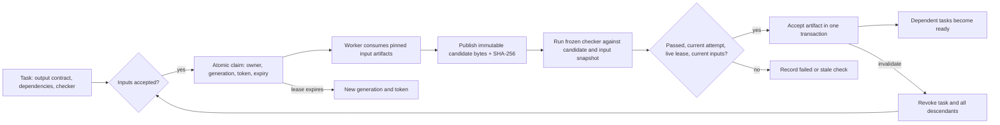

# From an accidental blackboard to an explicit coordination mechanism

DSCO now has a native `blackboard` tool backed by a local SQLite database. Separate workers can claim work, publish immutable candidates, run declared checks, and release dependent work when a candidate is accepted. Every transition survives the process that made it. The same tool works through `--tool-exec` and MCP.

The important distinction is between **“I produced something”** and **“this exact version has passed the agreed check, using these exact inputs, and is still current.”** A publication establishes the first. Acceptance establishes the second.

This document explains the article's mechanism, the implementation, and a runnable demonstration. Implementation: [blackboard.c](../src/blackboard.c). Behavioral verification: [test_blackboard.py](../tests/test_blackboard.py).

## What happened in the article

Giles Edwards-Alexander describes engineers storing plans beside source code. Their plans shared stable specification identifiers, described dependencies, and recorded progress and interface decisions. Frequent Git integration happened to distribute those records. An agent could see that another agent was handling an integration point, wait, and then use the resulting implementation notes.

That is more than sharing a task list. The plans carried four kinds of information:

1. **Intent:** what this worker expects to change and provide.
2. **Ownership:** who appears to be handling a piece of work.
3. **Dependency:** what another piece of work needs before it can proceed.
4. **Evidence:** what was actually implemented and how to consume it.

The repository supplied a common namespace, persistence, propagation, and a place to inspect concrete work. Those properties made coordination possible. The natural-language plans supplied the meaning.

The weakness was coupling the communication rate to source integration. Progress updates benefited from frequent propagation; CI did not benefit from running for every progress update. Reducing pushes reduced visibility. A dedicated board separates those rates while retaining explicit links to the artifacts being integrated.

The report demonstrates a useful behavior under one team's conditions. It does not establish a reproducible speedup, production readiness of the airline system, or correctness under competing claims, crashes, and delayed updates. Those questions need independent tests.

The author's [Talwrn foundation description](https://overwatering.org/blog/2026/08/talwrn-laying-the-foundation/) describes an append-only, Git-oriented design with deterministic claim resolution. Converging on a winner after synchronization is useful, but two workers can still act before they learn which claim won. DSCO's mechanism below uses a local authoritative transaction for claims and a second authoritative decision for acceptance.

## The mechanism in one picture



A **task** is a stable name and an immutable contract. A **claim** is a temporary right to publish for one attempt. A **candidate** is an immutable text artifact. A **check receipt** records an actual checker execution. An **accepted artifact** is the task's currently valid output. An **event** explains a committed transition.

The board does not need an LLM to decide whether a task is ready. Readiness follows from recorded state. Agents still perform the engineering work, choose useful decompositions, and interpret results.

## Durable records and their jobs

| Record | Stored information | What it establishes |
|---|---|---|
| Task | Stable ID, title, dependency IDs, checker command, checker working directory | What the worker agreed to produce and how it will be checked |
| Claim | Owner label, increasing generation, random token, expiry | Which attempt may currently publish |
| Attempt inputs | Dependency task IDs and exact accepted artifact IDs | Which versions this attempt consumed |
| Artifact | Artifact ID, task, generation, exact UTF-8 payload, SHA-256 | An immutable candidate, independent of a mutable file path |
| Check receipt | Artifact ID, command success, acceptance decision, bounded output, timestamp | What ran and whether its result was still applicable |
| Event | Increasing cursor, task, generation, transition, detail, timestamp | A durable explanation for workers and operators |

The tables are `bb_tasks`, `bb_deps`, `bb_inputs`, `bb_artifacts`, `bb_checks`, and `bb_events`. Database schema initialization is transactional. SQLite WAL and `synchronous=FULL` are used for mutations. The parent directory must already exist. Read-only actions do not create a missing board.

## Ownership that survives delayed workers

Suppose Alice claims `evaluator` as generation 7 and then stops responding. After the lease expires, Bob claims generation 8. Alice eventually finishes and tries to publish generation 7.

The publication must match all of:

```text
requested task       = recorded task
requested owner      = recorded owner
requested generation = recorded generation
requested token      = recorded token
recorded expiry      > current time
recorded state       = claimed or candidate
pinned inputs        = still accepted input versions
```

Alice's publication fails. This remains true if Bob uses the same owner name as Alice: the generation and random token changed. The lease cannot be renewed after expiry. Reclaim increments the generation and replaces the token in one write transaction, so two competing processes cannot both acquire the same attempt.

An owner is a human-readable label, not an authenticated security principal. The token fences stale attempts; it is not a defense against someone who can directly modify the database. All participating local workers are inside the same trust boundary.

This also fixes a separate defect in DSCO's existing IPC queue. Previously, completing a task updated its row by ID alone. A stale worker could overwrite a task after reassignment. IPC transitions now require the current identity, owning PID, generation, and an active state; a zero-row update is a rejection. Durable boot work is claimed before model execution. The legacy queue still carries conversational task results; it does not gain artifact verification merely because its ownership checks improved.

## Publication and acceptance are different operations

`publish` stores the payload bytes and their SHA-256 once for the current attempt. Retrying the same publication returns the same artifact ID. A different payload for that attempt is rejected. To revise work, invalidate the attempt or recover it after expiry and claim a new generation.

`verify` uses the checker fixed when the task was created:

1. Read the current candidate and its pinned inputs in a consistent database transaction.
2. Materialize a JSON snapshot in a private temporary directory beside the database.
3. End the transaction before executing the checker.
4. Invoke the normal DSCO `bash` tool through `tools_execute_for_tier()` using the caller's execution tier.
5. Reopen a write transaction and recheck the candidate, generation, lease, and input versions.
6. Record the check receipt and, if every condition holds, accept the artifact and record the acceptance event together.

The checker reads `$DSCO_BLACKBOARD_SNAPSHOT`. Its JSON shape is:

```json
{
  "artifact": 3,
  "task": "search",
  "generation": 1,
  "payload": "the exact candidate bytes",
  "sha256": "...",
  "inputs": [
    {
      "task": "evaluator",
      "artifact": 1,
      "sha256": "...",
      "payload": "the exact accepted input bytes"
    }
  ]
}
```

A zero exit status means the declared check passed. It does not by itself mean acceptance succeeded. A checker can pass after its lease expired or an upstream artifact was invalidated. Such a receipt records `passed: true`, `accepted: false`, and `current: false`.

An agent cannot replace the check by passing `verified: true`, an explanation, or a new command to `verify`. The check command and its working directory are immutable task fields. A repeated `verify` of the currently accepted artifact returns `already_accepted: true` without rerunning it.

The temporary snapshot is removed after ordinary execution. A crash can leave a snapshot directory; it does not turn the candidate into an accepted output. Checks should be bounded and safe to repeat: two callers may run the same checker, or a caller may retry after a crash. The acceptance transition remains fenced, but arbitrary external effects are not made exactly-once.

## Dependency release and invalidation

A dependent task can be claimed only when every prerequisite has a currently accepted artifact. Claiming the dependent stores those exact artifact IDs. Reading “whatever is latest” later does not change its inputs.

Task state is deliberately small:

| State | Meaning |
|---|---|
| `pending` | No current attempt. `ready` is derived from accepted dependencies. |
| `claimed` | One unexpired attempt may work and publish. |
| `candidate` | Immutable bytes exist; acceptance is outstanding. |
| `accepted` | The current output passed its check and the final freshness check. |

`invalidate` requires the task's current generation and a reason. It traverses the dependency graph, clears acceptance and claims for the task and every descendant, and increases their generations. The entire change is transactional. Old artifacts and check receipts remain available for inspection.

This is deliberately conservative. A downstream output may happen to remain valid after an upstream change, but retaining it requires proof the current implementation does not attempt. Recompute and recheck is the default.

Dependencies must reference previously created tasks, and dependency edges cannot be edited. This makes cycles impossible through the API. A changed contract gets a new task ID; invalidation reruns an existing contract rather than silently rewriting its meaning.

## A real, small example

The [executable demonstration](../examples/blackboard/demo.py) uses three tasks:

```text
[evaluator] ─┐
            ├──> [search]
[cost] ─────┘
```

Two workers independently publish Python functions. The evaluator rejects aircraft or crew conflicts across three simultaneous flights. The cost function charges 100 units for a cancelled flight and one unit for using the second aircraft. Only two aircraft and two crews are available.

After both functions are checked and accepted, the search worker claims its task, retrieves their exact artifact versions, and evaluates all 125 assignments. It publishes a feasible plan costing 101. Its separate checker recomputes feasibility and the minimum using the pinned functions. The result, input hashes, receipts, and full event history remain on disk.

This is a bounded coordination example, not a complete airline recovery application. The worker algorithms are explicit Python, so the demonstration exercises the mechanism without spending on model inference or hiding nondeterminism inside a model response.

From the repository root:

```bash
make dsco

demo_dir="$(mktemp -d /tmp/dsco-blackboard-demo.XXXXXX)"
python3 examples/blackboard/demo.py --binary ./dsco --directory "$demo_dir"
```

The directory contains `board.sqlite` and `result.json`. Choose a fresh directory for each run; the demonstration refuses to overwrite an existing board.

## Calling the tool

Use the same JSON with direct CLI execution or as MCP `tools/call` arguments:

```bash
./dsco --tool-exec blackboard \
  '{"action":"status","path":"/absolute/path/to/board.sqlite"}'
```

MCP exposes the tool with:

```bash
./dsco mcp serve --toolsets all --tier trusted
```

The tool is discoverable rather than permanently adding a large schema to every agent request. Select/load `blackboard` when coordinating a group of workers.

| Action | Additional fields | Result / behavior |
|---|---|---|
| `create` | `task`, `title`, `check`, optional `dependencies` | Create an immutable contract; an identical retry is harmless. |
| `status` | Optional `task` or `artifact`, `after`, `limit` | Inspect readiness or exact historical bytes and check receipts. |
| `events` | Optional `after`, `task`, `limit` | Read events after a cursor, with `next_cursor` for resumption. |
| `claim` | `owner`, optional `task`, `ttl` | Claim a ready task or return `claimed: false`; return generation, token, expiry, and input references. |
| `renew` | `task`, `owner`, `generation`, `token`, optional `ttl` | Extend an unexpired claim; cannot revive an expired one. |
| `publish` | Claim fields plus `payload` | Persist immutable candidate bytes, returning artifact ID and hash. |
| `verify` | `artifact` | Run the fixed check and record the fenced acceptance decision. |
| `invalidate` | `task`, current `generation`, `reason` | Revoke this task and its descendants atomically. |

Every action requires `action` and an explicit `path`. Prefer absolute paths so workers in different working directories open the same board. Claim TTL defaults to 300 seconds and must be between 1 and 3600. Verification currently has a 120-second execution ceiling; renew to cover the expected check time before invoking it.

Payloads are UTF-8 strings up to 32,768 bytes; contracts have at most 16 dependencies. Events default to 20 records, with a maximum of 100 per call. Claim responses contain references and hashes rather than all input bodies, keeping model context bounded. Task lists and event lists each have their own `next_cursor`; pass it as `after` to continue that list. Fetch an input's exact bytes with `status` and its artifact ID. Check output is bounded to 8 KiB.

An artifact receipt's `accepted_at_check` describes history. Inspect the task's current `accepted` field to determine whether the artifact is still authoritative.

## The worker protocol

A worker needs a short loop, not an always-running model conversation:

```text
1. Read relevant new events using the saved cursor.
2. Claim a ready task.
3. If none is ready, wait outside the model loop or end this worker turn.
4. Retrieve the claimed input artifact IDs; work from those versions.
5. Renew before expiry while work continues.
6. Publish the candidate using the original generation and token.
7. Verify the returned artifact ID and inspect accepted, not just passed.
8. On rejection, inspect the receipt/state and decide whether to retry,
   invalidate with evidence, or change the task contract under a new ID.
```

No model needs to reread the whole repository or repeatedly ask whether another worker finished. A scheduler can use readiness and cursors to wake workers cheaply. This implementation provides the state and protocol; it does not automatically start a fleet or inject events into every existing agent session.

Existing mechanisms retain clear roles: `goal_queue` plans within a session, IPC routes durable identities and messages, and `blackboard` governs shared artifact dependencies. Nothing automatically migrates a conversation plan into a shared graph. An orchestrator explicitly creates the contracts it wants workers to share.

## Authority and practical limits

- **Local coordination:** processes share one local SQLite database. Do not put its WAL files on a network filesystem or advertise it as a partition-tolerant multi-host service. A future remote authority would own the database and expose the same transitions.
- **Trusted checks:** a checker can be weak, wrong, or deliberately permissive. `true` accepts anything. The mechanism enforces the declared test and freshness, not the adequacy of the test. Review the contract as carefully as the implementation.
- **Pinned bytes:** artifact and input bytes are immutable through this API. A payload that merely names a mutable branch or URL does not freeze its target. For repository changes, publish a manifest containing immutable commit IDs and content hashes, and make the checker verify them in isolated worktrees.
- **Check environment:** the command text and original working directory are recorded; the complete filesystem, interpreter, dependencies, and environment are not snapshotted. Reproducible builds need those versions pinned separately.
- **External writes:** rejecting a stale publication cannot undo a file modification, deployment, or payment already made by a worker. Use isolated worktrees and require the authoritative acceptance decision before integrating changes. Side-effecting destinations need their own fencing or idempotency.
- **Permissions:** status/events require read capability. Other actions require write; verify also requires exec. The nested checker passes through the gate again using its actual command and inherited tier, including network/secret restrictions. Granting write does not grant permission to execute a checker. A scoped write grant must include the board's parent directory because SQLite sidecars and temporary snapshots also live there.
- **Clock and availability:** leases use the host's wall clock. Generation fencing still rejects an older attempt after reassignment, but substantial clock corrections can affect lease timing. A database unavailable for writes cannot safely grant ownership. There is no disconnected claim mode.
- **Retention and scheduling:** event/artifact history grows until managed operationally. The current scheduler is oldest-created ready work, without priorities, fairness guarantees, cancellation policy, or automated garbage collection.

## Verification and what it proves

```bash
make test-blackboard
make test-gate-claims
```

The conformance test starts real DSCO MCP processes and runs actual Python checkers. It covers competing claims, restart persistence, same-name stale attempts, lease expiry, failed checks, immutable/idempotent publication, transitive invalidation, a successful checker racing an upstream invalidation, bounded event cursors, malformed contracts, and capability denials. A separate compiled IPC regression reproduces the stale-completion scenario against `src/ipc.c` and now requires rejection. A local provider fixture also proves the full CLI claims a boot task before its provider request and rejects a completed boot before a second request.

Those are behavioral guarantees of this bounded implementation. They are not a measured engineering speedup, a formal proof, or evidence that arbitrary generated software meets a production contract.

## Sources and design lineage

The motivating account is Giles Edwards-Alexander's [An Accidental Blackboard](https://martinfowler.com/articles/exploring-gen-ai/an-accidental-blackboard.html). The important lesson is to make shared intent, dependencies, progress, and results visible without requiring a source-control operation for every update.

Classical [Hearsay-II](https://mas.cs.umass.edu/Documents/Erman_Hearsay80.pdf) separates shared hypotheses from control over which knowledge source acts next. [Linda's generative communication](https://www.cs.tufts.edu/comp/150FP/archive/david-gelernter/generative-linda.pdf) supplies a useful distinction between observing shared data and atomically withdrawing work. DSCO's typed records and explicit claims are an engineering choice for this narrower workflow, not a claim to implement all of either system.

The local deployment boundary follows [SQLite's WAL documentation](https://www.sqlite.org/wal.html). A future remote authority would need explicit consistency and watch semantics such as those described in [etcd's API guarantees](https://etcd.io/docs/v3.6/learning/api_guarantees/), together with authentication, artifact access control, and failure testing.
