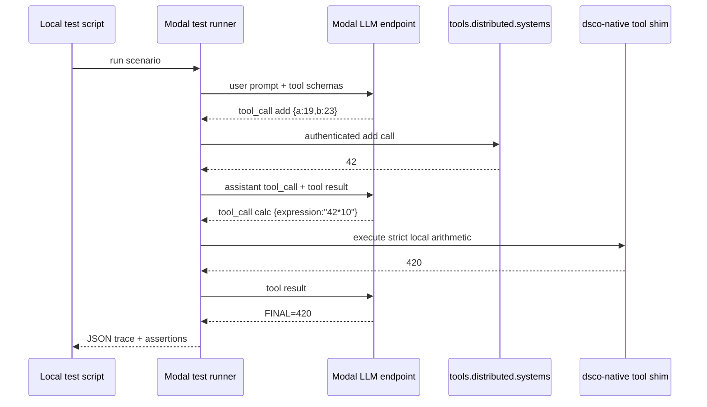

# We Put an Agent on Modal, Gave It Tools, and Learned Where the Real Boundary Is

`dsco` is a local edge runtime: it owns files, shell access, tool policy, local
telemetry, and the user-facing conversation loop. Modal is a good place to run
large models and hosted services. `tools.distributed.systems` is a good place to
host shared tools. The interesting engineering problem is not whether those
pieces can talk to each other. They can. The problem is where authority should
live.

The short version: the model can be remote, the tool catalog can be remote, but
the policy boundary has to stay explicit.

## The Setup

We had a live Modal endpoint serving an OpenAI-compatible chat-completions
surface:

```sh
export MODAL_ENDPOINT_URL='https://arthurcolle--ep-agent-server.us-west.modal.direct'
dsco -m modal/zai-org/GLM-5.2-FP8 'Reply with exactly OK.'
```

The endpoint requires Modal proxy auth via `Modal-Key` and `Modal-Secret`
headers. `dsco` already knows that shape: the Modal provider path reads
`MODAL_KEY` / `MODAL_SECRET`, or their proxy-token aliases, and targets
`$MODAL_ENDPOINT_URL/v1/chat/completions`.

Separately, `dsco` has a native Tool Management client:

```sh
dsco tools list --limit 5
dsco tools run add a=19 b=23
```

That client defaults to:

```text
https://tools.distributed.systems
```

and uses `TOOLS_API_TOKEN` or `AUTH_TOKEN` as its bearer token. With a token, the
hosted catalog returned tools like `add`, `subtract`, `multiply`, `divide`, and
`uppercase`; a concrete remote run of `add a=19 b=23` returned `42`.

So we had three live surfaces:

- the local `dsco` runtime and native tool kit
- a Modal-hosted LLM
- the hosted `tools.distributed.systems` tool plane

The first test proved the basics: route to Modal, discover native tools, execute
native `calc`, query the hosted catalog, and run a live model turn that actually
called a tool.

## The First Trap

The tempting test is:

```sh
TOOLS_API_TOKEN=... \
MODAL_KEY=... \
MODAL_SECRET=... \
dsco -m modal/zai-org/GLM-5.2-FP8 --approval-mode never --trust-tier trusted \
  'Use tools.distributed.systems and local tools to solve this.'
```

That is exactly the wrong boundary.

It puts high-value credentials in the same process environment as a live
external model-driven tool loop. Even if the prompt is benign, a model with tool
access can be induced to inspect environment, shell out, print request debug
state, or forward secrets. The issue is not whether the model is malicious. The
issue is that credentials and ambient tool authority are now in the same blast
radius.

The fix is simple and important:

```text
Secrets are for the runner. Tool schemas are for the model.
```

The model should see tool names, descriptions, schemas, and prior tool results.
It should not see bearer tokens. It should not inherit bearer tokens. It should
not be able to ask the shell for bearer tokens.

## The Right End-to-End Test

A proper multi-turn test should run as a harness. The harness owns secrets and
executes tools. The model only emits tool calls.



A good minimal scenario is:

```text
Use the hosted add tool to add 19 and 23.
Then use native calc to multiply that result by 10.
Reply exactly FINAL=420.
```

The test should assert the trace, not just final text:

```json
[
  {"turn": 1, "tool": "add", "surface": "tools.distributed.systems"},
  {"result": 42},
  {"turn": 2, "tool": "calc", "surface": "dsco-native"},
  {"result": 420},
  {"turn": 3, "final": "FINAL=420"}
]
```

This proves the real behavior:

- tool schemas reach the model
- the model emits structured tool calls
- hosted tools execute with server-side secrets
- native tools execute through a constrained local shim
- prior assistant tool calls and tool results are replayed correctly
- the model can synthesize a final answer after multiple tool turns

## What We Shipped Locally

The local smoke script is:

```sh
scripts/test_modal_tool_calling.sh
```

It checks five things:

1. `dsco` routes `modal/zai-org/GLM-5.2-FP8` to the Modal provider.
2. native tools include `calc`, `cwd`, `read_file`, and `discover_tools`.
3. native `calc` returns `444` for `19*23+7`.
4. `tools.distributed.systems` is reachable and can run hosted `add`.
5. the live Modal model can call native `calc` in a tool turn.

The script intentionally strips `TOOLS_API_TOKEN` and `AUTH_TOKEN` from the live
model process before the LLM tool-calling check. That keeps the hosted tool
token out of the model-visible runtime.

## Optimizing the Loop

Once the multi-turn flow is correct, the next target is measurement.

`dsco` already has a request-parameter escape hatch for OpenAI-compatible
providers:

```sh
export DSCO_OPENAI_PARAMS='{
  "temperature": 0,
  "logprobs": true,
  "top_logprobs": 5,
  "stream_options": {"include_usage": true},
  "parallel_tool_calls": false
}'
```

The request builder allowlists these fields and passes them through to Modal’s
OpenAI-compatible endpoint. This is enough to test provider acceptance of
logprobs and usage streaming.

There are two separate questions:

- Does the provider accept `logprobs` / `top_logprobs` in the request?
- Does `dsco` parse and persist returned logprob data?

The first is enabled now through `DSCO_OPENAI_PARAMS`. The second is not fully
implemented yet: `dsco` parses usage, latency, tool-call deltas, reasoning text,
model IDs, and cost metadata, but it does not yet surface a normalized logprob
trace from streaming chunks.

That means the immediate optimization stack should be:

- `stream_options.include_usage=true` for authoritative token accounting
- `temperature=0` and `seed` where the backend supports it for deterministic
  regression tests
- `parallel_tool_calls=false` for simpler multi-turn assertions
- `reasoning_effort` only when the backend supports it and it improves tool-call
  reliability
- `DSCO_DEBUG_REQUEST=1` for one-off request-shape inspection
- later: response-side logprob extraction into Chronicle/Baseline

## Why Modal Is the Right Place for the Full Harness

Running the full test on Modal has three advantages.

First, secrets stay server-side. The harness can read Modal Secrets and
`TOOLS_API_TOKEN`, but the model receives only schemas and tool results.

Second, the trace is canonical. The runner can emit a JSON object containing
every request, tool call, tool result, latency, token count, and assertion.

Third, it lets us test deployed reality. A local unit test can prove parser
logic. A Modal runner proves that the deployed model endpoint, hosted tool
plane, auth headers, tool-call replay format, and final answer all work
together.

The target output should look like this:

```json
{
  "ok": true,
  "model": "modal/zai-org/GLM-5.2-FP8",
  "turns": 3,
  "tool_calls": [
    {"name": "add", "surface": "tools.distributed.systems", "ok": true},
    {"name": "calc", "surface": "dsco-native", "ok": true}
  ],
  "final": "FINAL=420",
  "usage": {
    "input_tokens": 1234,
    "output_tokens": 87
  }
}
```

## The Design Rule

The durable architecture is not “give the model all the tools.” It is:

```text
Model proposes. Runner executes. Local policy records. Hosted planes accelerate.
```

That is the line that makes the system useful without making it brittle. Modal
can host the model and the test runner. `tools.distributed.systems` can host the
shared tool plane. `dsco` remains the edge runtime that owns local policy,
traceability, and user trust.

That is the shape worth building around.
