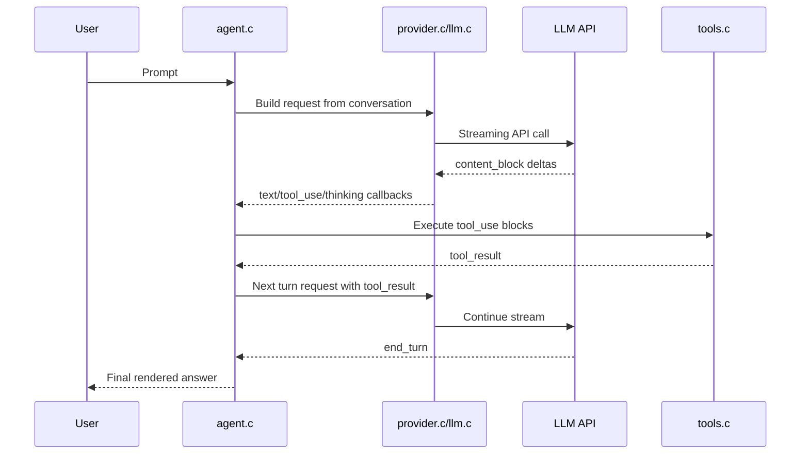
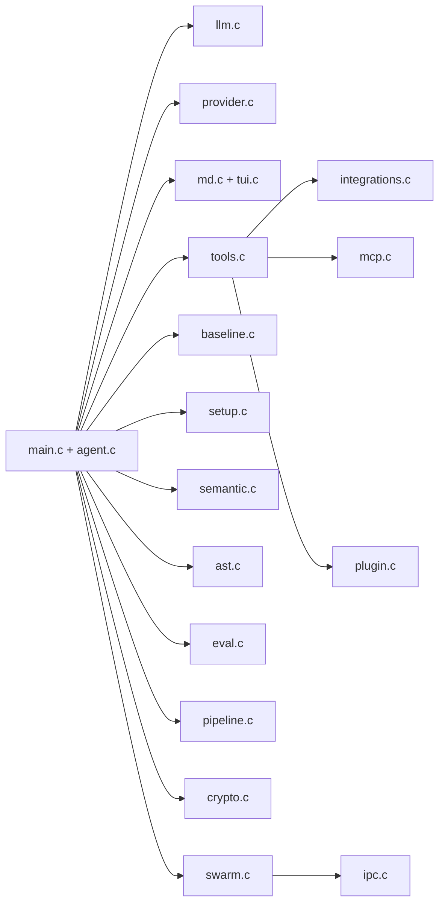
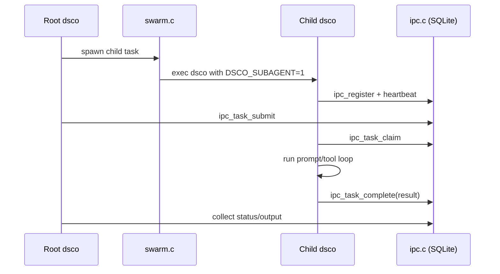
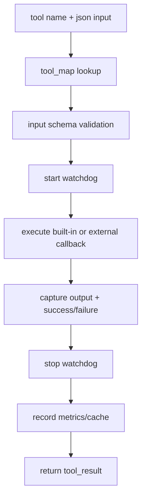
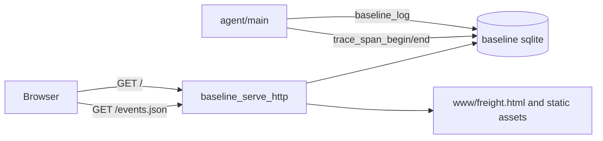
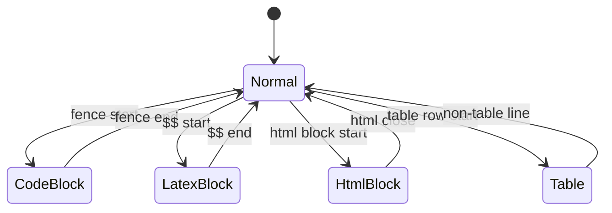
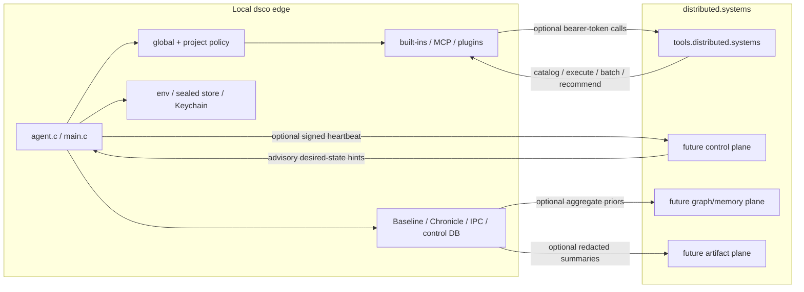

# Architecture Diagrams

## 1. Interactive Turn Sequence

## 2. Component Topology

## 3. Swarm + IPC Lifecycle

## 4. Tool Dispatch Pipeline

## 5. Baseline Timeline Data Flow

## 6. Markdown Streaming Renderer State

## 7. Local-First Hosted Control Plane

`dsco` should treat hosted `distributed.systems` services as optional
accelerators. Local execution, policy, secrets, and audit state remain
authoritative; hosted planes provide shared tool discovery, durable remote work,
fleet health, and advisory routing data.

See [`LOCAL_CONTROL_PLANE.md`](LOCAL_CONTROL_PLANE.md) for the detailed
hybrid-control-plane flows, sync policy, offline behavior, and service split.
