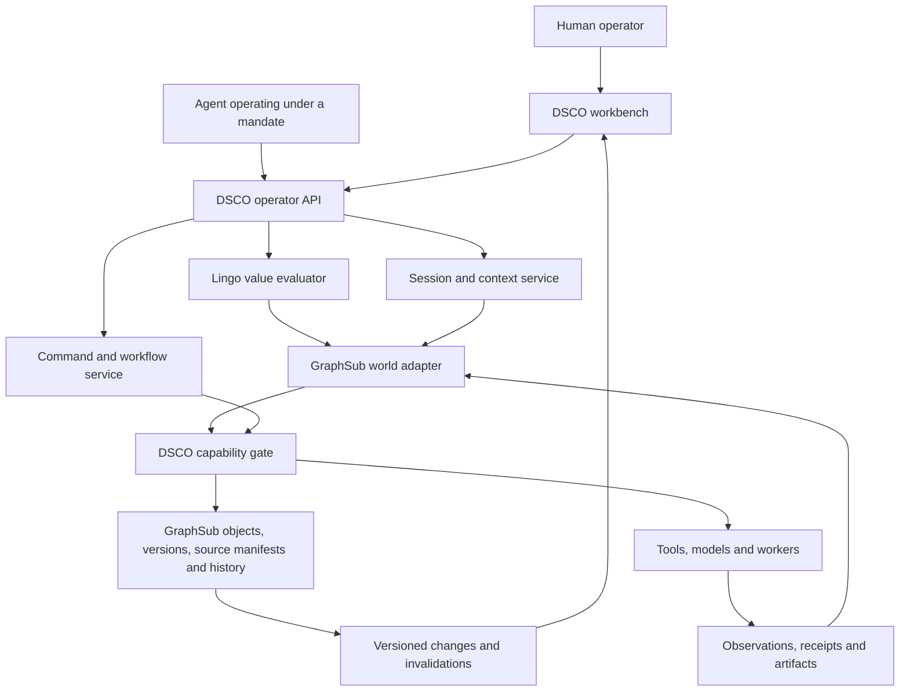

# DSCO as the primary operator for GraphSub

**Comprehensive target definition, version 1.0 — September 9, 2026.**

**Implementation update, September 10:** The [local Lingo workbench](lingo/WORKBENCH.md)
now opens typed worksheets, retains an owned session, inspects dependencies,
compares scenario controls, and saves/reopens the selected value through terminal
or MCP operations. [Lingo 0.2](LINGO.md) also supplies
[shared platform classes](LINGO_PLATFORM.md), portable value addresses, registered
source identities and [GraphSub stored-world artifacts](lingo/WORLDS.md), verified
across an actual engine restart and through the Python SDK. This is the executable
foundation for the operator below. MVCC workspaces, mutable heads, subscriptions,
distributed evaluation and the complete interactive workbench remain target bindings.

This document defines the composition of existing DSCO, Lingo and GraphSub facilities into one operator. GraphSub already contains typed schemas, schema histories, MVCC and persistent transaction stores, graph persistence, sequenced events and replay, incremental collections, compute graphs, source hydration and a transactional SQLite outbox. The work is to bind these implementations to one coherent object, value, source and execution context. The [adapter review](operator/GRAPHSUB_ADAPTER_REVIEW.md) maps source implementations, existing routes and specific integration boundaries; the [implementation map](operator/IMPLEMENTATION_MAP.md) identifies DSCO bindings. The executable in-memory Lingo core remains documented separately in [LINGO.md](LINGO.md). Requirements below define the composed system, not a claim that every binding is already callable.

## 1. The product relationship

**GraphSub is the shared world. Lingo is the language for describing and working with that world. DSCO is the operator's working environment and the runtime that performs authorized work against it.**

An operator should be able to open a task, inspect a calculated readiness value, follow a dependency to an artifact, open the code that calculated its quality score, test another assumption, review a resulting change, run an authorized action, and inspect its receipt without losing the identity or context of the work.

That continuity is the useful SecView inheritance. The notes join browsing, typed value access, dependency navigation, source editing, evaluation and database context. [The lineage document](operator/SECDB_OPERATOR_LINEAGE.md) traces those ideas to the supplied pages. Durable subscriptions, distributed workers, explicit authority and recovery are our extensions with their own contracts.

A person and an agent use the same semantic services. A TUI form, a Lingo expression, an MCP call and a headless job are different entry points into those services. None gets a second, less governed route to write objects or execute tools.

Every remote object read, commit, subscription request and receipt publication traverses an admitted GraphSub adapter operation, including transport capability checks and provenance propagation. The adapter is not an alternative route around DSCO governance.

GraphSub stores the definitions and evidence needed to understand calculations and provides existing native compute machinery. DSCO owns operator admission, Lingo evaluation and execution routing: it can execute a Lingo calculation locally or submit a compatible, versioned graph/kernel to a GraphSub executor. Both paths retain the same context and result certificate. Loading an object from storage never implicitly executes arbitrary code or calls a model.

The inheritance is direct: **SecDB → GraphSub, Slang → Lingo, SecView → DSCO**. DSCO's browser, value inspector, source editor, expression console, scenario workspace and run monitor all operate on the same references. There is no separate application model hidden behind each panel.

### Existing foundations to compose

| Operator responsibility | Existing GraphSub foundation | Binding decision |
|---|---|---|
| Typed object inspector | `specialized/schema.rs`, `specialized/registry.rs` | Map stored fields, references, validators and display metadata into the inspector and Lingo type descriptors |
| Class history and source browser | `dynamic_schema/versioning.rs`, `agents/ontology.rs` source hydration | Resolve exact schema/source artifacts into a manifest; preserve existing history and provenance |
| Pinned reads and conditional edits | `specialized/mvcc.rs`, `txn/mvcc_store.rs`, `txn/persistent_store.rs` | Select a storage lane explicitly and expose its demonstrated visibility and commit semantics |
| Committed changes and dispatch queue | `storage/sqlite_honker.rs` graph-write/outbox transaction | Reuse the atomic outbox pattern and queue ownership; bind tenant, request identity and fencing requirements |
| History, snapshots and replay | `specialized/event_store.rs` and `/api/v1/events`, `/api/v1/snapshots`, `/api/v1/replay` | Use retained history; distinguish read-only historical inspection from replay into a live graph |
| Calculations and reactive collections | `compute/graph.rs`, `compute/runtime.rs`, `storage/streaming.rs` | Bind supported native operations; connect Lingo's realized reads and invalidations to existing incremental operators |
| Run and dependency inspection | `observability/trace.rs`, trace APIs and flow runner | Reuse flow/step identities and inspection, with storage-backed checkpoints where durable execution is promised |

These are distinct existing storage and execution lanes, not interchangeable names for one already unified service. The adapter's job includes choosing and exposing the lane and checking its guarantees. Detailed paths, callers and limitations are recorded in the [source-backed review](operator/GRAPHSUB_ADAPTER_REVIEW.md).

## 2. The complete definition set

| Document | Defines |
|---|---|
| This document | Product model, ownership, object vocabulary, workflows, authority and completion criteria |
| [Live GraphSub browsing](operator/LIVE_BROWSE.md) | Implemented Lingo attachment, native object reads and schema browsing through DSCO's gate |
| [Operator surfaces](operator/OPERATOR_SURFACES.md) | Workbench, buffers, views, commands, navigation and visible states |
| [World protocol](operator/WORLD_PROTOCOL.md) | Identity, snapshots, transactions, evaluation, watches, errors and adapter requirements |
| [Lingo operator language](operator/LINGO_OPERATOR_LANGUAGE.md) | Target language modules and semantics beyond the implemented 0.1 core |
| [Operation catalog](operator/contracts/operations.json) | Machine-readable semantic operation IDs, admission classes and required backend features |
| [Record schemas](operator/contracts/records.schema.json) | Structural contracts for central records, with valid/invalid fixtures |
| [Implementation map](operator/IMPLEMENTATION_MAP.md) | What exists, what is missing, integration locations and acceptance slices |
| [GraphSub adapter review](operator/GRAPHSUB_ADAPTER_REVIEW.md) | Source-backed evidence and limits of the currently available GraphSub surfaces |
| [SecDB operator lineage](operator/SECDB_OPERATOR_LINEAGE.md) | What the notes support, what is ambiguous, and what we are adding |

The prose governs behavior and consistency. JSON Schema checks record shape; it cannot prove authorization, atomicity, idempotency, snapshot coherence or correct invalidation. Proposed commands and Lingo bindings in this definition are not current executable features unless explicitly identified as such.

## 3. First-class concepts

These identities must remain distinct, even when they appear in the same panel.

| Concept | Meaning | Lifetime and owner |
|---|---|---|
| Object | Stable identity for a domain entity, with immutable revisions | GraphSub world |
| Value address | Object identity + field + canonical typed arguments, independent of context | Semantic address; survives view changes |
| Evaluation | One attempt to calculate a value from exact inputs and source; evaluated-node identity is `(context_id, value_address)` | DSCO admission and evaluator routing; local or GraphSub compute; evidence retained by policy |
| Observation | An immutable record of something learned from outside the pure graph | DSCO adapter captures; GraphSub retains |
| Workspace | A writable branch over pinned parent roots | GraphSub, with local uncommitted drafts |
| Scenario | An immutable description of hypothetical overrides over a pinned baseline | GraphSub may store definition; evaluator applies it |
| Source artifact | Exact Lingo/native module content and metadata | Content-addressed source store |
| Source manifest | Exact resolved package/class/function generations | GraphSub source catalog |
| Buffer | Editable text or typed draft content with a revision | DSCO buffer service; optional persistent target |
| View | Presentation of an object, value, buffer, comparison or run | Operator session/layout |
| Command | An explicit requested state transition or effect | DSCO admission and dispatch services |
| Run | Durable workflow instance with attempts, checkpoints and terminal criteria | GraphSub run records + DSCO workers/journals |
| Artifact | Identified content produced or imported by work | Blob/object storage with GraphSub metadata |
| Receipt | Evidence about a commit, action attempt, verification or decision | Append-only logical record |
| Session | Principal-bound operator attachment with context, selections and history | DSCO session service |
| Connection | Named authenticated route to a world service | Operator configuration; secrets stay outside graph payloads |

A buffer is not an object merely because it shows that object's JSON. A view is not a run because it displays progress. A returned value is not an accepted artifact because a calculation succeeded. These distinctions determine save, close, undo, cancel and retry behavior.

## 4. The world model

GraphSub exposes typed objects with a stable identity and immutable revisions. Display names are aliases. Renaming never rewrites all references. Tombstones preserve history and distinguish deletion from an object that never existed.

Each class descriptor defines stored fields, calculated fields, argument schemas, references, validators, display hints, code bindings, units and sensitivity labels. Display hints cannot inject executable UI code. A calculation implementation binds to an immutable source artifact and exported function.

The initial domain vocabulary is deliberately useful for DSCO itself:

| Object family | Required information | Common relationships and values |
|---|---|---|
| Organization / Project | Identity, namespace, owners, policies | Contains workspaces, task collections and releases |
| Task / AcceptanceContract | Inputs, requested outcome, criteria, budget, dependencies | Readiness, blockers, estimates, accepted outcome |
| Agent / Worker / Mandate | Logical identity, permitted role, executor, lease and limits | Assigned runs, availability, effective authority |
| Model / Route / PriceObservation | Provider and product identity, model version, measured capabilities, price timestamp and units | Eligibility, estimated cost, evidence quality |
| Tool / Adapter | Input/output schemas, effect class, capability requirements, version | Available operations, target constraints, retry semantics |
| Observation / Evidence | Source, capture time, source time, content hash, exact request context | Supports claims and computed values |
| Artifact / Dataset / Document | Content identity, schema, origin, lineage, storage locator | Validation results, parent artifacts and revisions |
| WorkflowDefinition / Run / Step / Attempt | Source manifest, input snapshot, state, ownership and receipts | Ready steps, unresolved actions, terminal outcome |
| Policy / Approval / Verification | Versioned rules, decision scope, checker identity and evidence | Admission, acceptance and promotion eligibility |
| Package / Class / ValueDefinition | Source artifact, interface and release identity | Used by object versions and evaluations |
| Scenario / Comparison | Baseline context, overrides, evaluation targets | Differences, affected dependencies and assumptions |
| Workspace / Changeset / Commit / Release | Roots, base, explicit writes, history and acceptance | Conflict sets, promoted versions, reversible descendants |
| Book / Portfolio / Collection | Membership rules, dimensions, units and grouping | Aggregated cost, work, risk, quality and outstanding obligations |

A book is an organized collection with declared aggregation rules. Numeric values carry units where units matter. USD, tokens, bytes, seconds and confidence estimates cannot be added merely because all are numbers. Currency amounts use fixed-scale decimal or integer minor units, not binary floating-point by default. Missing observations, expired observations and estimates are visible states.

An agent may propose a classification or claim. It cannot turn an unverified claim into verified truth by writing a status field. Authoritative state fields are projections of validated events or transitions, with their actor and evidence retained.

## 5. A context is part of every answer

An evaluation context pins:

- The authenticated principal, tenant, storage realm and authorization generation.
- Ordered object roots and their snapshots, plus exactly one writable destination when edits are allowed.
- An exact source manifest resolved from explicitly ordered source roots.
- The workspace branch and local draft digest, if drafts are deliberately included.
- The scenario definition/version, or an explicit baseline marker.
- Input observation versions, relevant policy versions and the evaluator/runtime identity.

Data roots and source roots are independent. This allows experimental code to be tested against historical data, or released code against a workspace change. The resulting view must show that combination plainly.

Resolution searches roots in declared order for a logical binding. It returns the winner, its origin and shadowing information permitted by authorization. It never merges fields from similarly named objects. A forbidden binding is not silently bypassed by falling back to a public object with the same name. Persistent references use stable identities, so later name-resolution changes cannot redirect them.

A nested workspace name does not imply inheritance. Roots are explicit. An initial persistent implementation supports one transaction domain; references to other realms are immutable imported observations or explicitly identified read-only composite snapshots. Cross-realm atomicity is not assumed.

A panel can either be **pinned** or **follow latest**. Pinned means the same context until an explicit rebind. Following means moving between successive coherent snapshots; it never means mixing individual fields from arbitrary moments. The status line shows origin, snapshot, manifest, workspace, scenario and connection freshness. The operator can expand the complete context record.

## 6. Five distinct operations on state

| Operation | What changes | What does not follow automatically |
|---|---|---|
| Read / evaluate | A value is fetched or calculated; caches/evidence may be created | No domain mutation or external action |
| Edit draft | Local staged stored fields or source text | No shared commit |
| Commit changeset | Version-checked writes become a new shared revision atomically | No external tool effect or deployment |
| Apply scenario | Hypothetical read semantics in a pinned context | No base mutation, authority change or commit |
| Execute command | An admitted real action or workflow step | No guarantee that a missing response means the action failed |

**Save** persists a buffer to its declared target. Saving a source draft, publishing a package, promoting a release, committing domain data and deploying an artifact are separate named actions. The UI displays the destination and effect of each action.

Drafts carry their base revisions. A commit contains expected revisions and a read set for values on which the change depends. Validation, authorization, conflict detection, durable writes and append to a commit outbox/change log form one backend transaction. Stream delivery occurs afterward, at least once, with replayable cursors and deduplication. A conflict returns the base, current and proposed versions with machine-readable conflict details. No default last-writer-wins behavior is acceptable for arbitrary objects.

Undo before commit removes draft changes. Undo after commit creates a new conditional changeset against current state. An external action may have a compensating action, but compensation is not time travel and may itself fail.

## 7. Values, dependencies and recomputation

Dependencies exist between specific value nodes, not just objects. A node address includes object identity, field and canonical arguments; an evaluation adds context, source and input revisions. Reads register the realized dependency set, including branch selectors, query predicates/index revisions and existence tests.

Changing a branch selector invalidates a calculation and allows a different read set to emerge. The replaced read set drops obsolete edges. A failed evaluation is not a new valid value. A previous successful result can remain visible only as an explicitly labeled historical result.

A cache entry is an optimization over a proven context. Its key includes tenant/visibility scope, context digest, source manifest, value address and evaluator profile. Reuse requires a matching revision certificate or validated read set. Invalidation messages improve responsiveness; absence of a message is not evidence of freshness after a disconnect.

A new shared commit does not make a historical result false in its pinned context. It tells following views that a newer context is available. Their current-state projection becomes stale until evaluated against that context; retained historical evaluations remain tied to their original inputs. The adapter preserves this distinction when extending the mutable local Lingo core.

Graph cycles produce a path diagnostic. Ordinary calculated fields do not iterate toward a fixed point automatically. Solvers are explicit bounded kernels with declared convergence and failure criteria. Dynamic query dependencies use query/index generations or conservative whole-collection invalidation until finer tracking is proven.

External state is captured as an observation: model output, current time, random seed, HTTP response, file contents, provider price and human judgment. Calculations consume observations. A fresh provider call is an explicit command, never an invisible cache miss.

The [world protocol](operator/WORLD_PROTOCOL.md) specifies validity, evaluation cancellation, coalescing, provenance and subscriptions. The [language definition](operator/LINGO_OPERATOR_LANGUAGE.md) specifies the calculation contract.

### A concrete calculation, from request to explanation

Suppose a task has 100 units of work. Its economy model costs 2 accounting units per work unit and its priority model costs 7. `Task.selected` chooses a model from `Task.urgent`; `Task.cost` multiplies work units by the selected model's unit cost. These are illustrative units, not provider prices.

| Operator action | What the evaluator actually does | Visible result |
|---|---|---|
| Ask for `task.cost` at baseline | Reads `task.units`, calculates `task.selected`, then reads the selected model's `unit_cost`; records those value dependencies | `200`, with an explanation linking to those inputs and exact source |
| Override `task.urgent = true` in a scenario | Creates another context; selection reads the priority reference and cost reads priority pricing | `700`, marked hypothetical; baseline still `200` |
| Exit the scenario | Releases the scenario demand; the baseline context and its evidence remain unchanged | `200` |
| Change economy unit cost to `3` in the local semantic world | Invalidates dependent cost; the next demand recomputes it without needing to rerun an unrelated priority calculation | `300`; the inspector shows one invalidation and a second cost evaluation |
| Make that change in the shared operator | Stages a draft, validates against GraphSub revisions, then conditionally commits; following views acquire the resulting coherent context | A commit receipt plus new evaluations; pinned historical views retain `200` |

The first four rows run today in [the local routing example](../examples/lingo/routing.lingo). Running it on September 9 returned `baseline=200`, `scenario.cost=700`, `repriced=300`, with the expected economy/priority dependency sets and no tool calls. The fifth row is the shared-world binding defined here. It connects the same calculation semantics to existing GraphSub revisions, transactions and events.

This also explains the operator's navigation: select `300`, open its inputs, follow the model reference, inspect the stored price and its origin, open the exact calculation source, compare an override, then review the changeset. Each pane shows a different part of the same computation and context.

## 8. Scenarios and comparisons

A saved scenario is an immutable override description, not an active mutable Lua stack. Its identity binds baseline snapshot, source manifest, parent scenario and typed override entries. Scenario evaluation may be local or distributed without altering its meaning.

Parent and child scenarios share the same baseline roots, snapshot, source manifest and observation set. Nesting changes only the override chain. Moving a scenario to different data or source creates an explicit rebased scenario with a new identity and validation; it never silently moves its parent.

Overriding a calculated node supplies its result directly and suspends its reads of lower nodes. Downstream calculations depend on that replacement. Removing the override reveals the underlying calculation or parent override again.

A normal comparison holds data snapshot, source, arguments and external observations constant and changes only the explicit scenario. A source comparison pins two manifests and labels that changed dimension. The UI lists every changed dimension; a result with different input data is not presented as a pure model/source/scenario comparison.

Comparisons retain both evaluation identities, units, absolute/relative differences where meaningful, categorical differences, invalid/error states, dependency changes and execution costs. Relative difference is undefined when its declared denominator is zero; the UI does not manufacture infinity as a useful business result.

Promotion converts selected stored-field overrides into a draft changeset against a chosen current baseline. Calculated overrides cannot become stored facts unless the schema explicitly permits a new observation or stored field. Scenario policy overrides are hypothetical data and never alter real DSCO capabilities or GraphSub authorization.

## 9. DSCO is the main workbench

The workbench has linked surfaces for connection/context, objects, values, dependency graphs, Lingo buffers, scenarios, changes, runs, events and evidence. [Operator surfaces](operator/OPERATOR_SURFACES.md) defines their contents and behavior.

A persistent session service owns the world attachment and subscription handles. A terminal or GUI is a client of that service. Closing a pane releases that pane's demand; closing an interactive client detaches it. Detached runs continue according to their declared ownership, budgets and cancellation policy. Reattaching reconstructs views from semantic identities, not saved memory addresses.

A human or agent can issue an operation by semantic command ID. Keyboard bindings, menus, natural language and MCP are adapters. An agent-generated command is shown and audited as the same operation a human could issue. Generated Lingo and accepted source remain inspectable artifacts.

The operator must always answer:

1. What object/value/run is this?
2. Which data, source, scenario and authority gave it this meaning?
3. Is this displayed result current, historical, hypothetical, pending or uncertain?
4. What would this operation change, and where?
5. What evidence establishes that the operation finished?

## 10. Workflows, agents and real effects

A workflow definition contains named steps, input/output contracts, source manifest, budgets, wait conditions and acceptance criteria. A run binds it to an input snapshot and principal. Lingo expresses step behavior; DSCO owns scheduling, admission, execution and evidence.

GraphSub durably records run state, desired step transitions, leases and action intents. DSCO workers retain local execution journals and emit immutable attempt receipts. A worker claims an intent with a fencing generation; each new side effect checks its current lease and authority. An expired worker may finish a previously dispatched operation, but its late receipt cannot silently advance a newer run generation.

For an external action:

1. Create an immutable action intent with target, normalized argument hash, expected postcondition, authority references and retry class.
2. Admit and durably record the intent before dispatch. Reserve declared budget where required.
3. The assigned worker records its attempt and dispatches through `tools_execute_for_tier()`.
4. Persist the observed outcome locally, then ingest the immutable receipt under its historical attempt identity. Advancing canonical run state is a separate conditional transition requiring the current fencing token.
5. Verify the required postcondition. Advance a step only when its completion rule holds.

A crash between dispatch and receipt creates **effect unknown**. Recovery examines target state or an adapter's idempotency mechanism; it does not automatically repeat the action. If the target offers neither deduplication nor a reliable observation, the run waits for an authorized reconciliation decision.

If the worker cannot validate its dispatch lease and authority, it cannot begin new shared effectful work. Target-enforced fencing or idempotency is used where supported. A lease can expire between a check and an external dispatch; for targets without fencing, a replacement owner must not redispatch an unresolved intent until reconciliation. A partition after dispatch retains the local receipt and presents a pending reconciliation state. Late receipts from expired workers remain ingestible as evidence under the original attempt identity, even when they cannot advance run state. GraphSub state and local execution evidence are distinct facts; the interface shows their synchronization status.

Durable checkpoints contain named next steps, JSON/domain values, references and pinned source. Arbitrary Lua stacks, native pointers and closures are not checkpoints. A new release does not mutate an in-flight run's code. Migration is an explicit, validated transition.

Agent proposals, model assessments, evaluator results and operator decisions are separate records. An evaluator independently verifies applicable criteria; it does not merely echo the producing agent's success claim. Accepted artifacts identify the exact checker/source/input/output versions and approving authority where approval was actually required.

## 11. Authority, identity and provenance

The effective authorization is the intersection of principal mandate, session tier, DSCO capability grants, tool target constraints, GraphSub resource permissions, live lease and applicable policy. A document or graph object can describe a permission request; it cannot grant authority merely by being read.

DSCO's existing capability vocabulary remains `fs_read`, `fs_write`, `net`, `exec`, `secrets`, `untrusted_in`, `control`. Object write permission is a GraphSub domain permission, not a newly invented replacement for those bits. Network access to GraphSub still requires the appropriate transport capability. Storage validates principal and tenant independently of a caller-supplied JSON field.

Every tool path uses `tools_execute_for_tier()`. Source imports, object payloads and tool results retain provenance/taint. A new script, child worker or saved scenario cannot erase a secret/untrusted-data flow boundary. Control-plane mutations retain their explicit control grant requirement. Read-only denial/authority inspection remains accessible under the existing introspection rules.

Credentials are connector handles, never fields in normal objects, buffers, source manifests or receipts. Hashes identify content; they do not make sensitive content public or prove the truth of its claims. Redaction applies to values, errors, traces, dependency names, cache lookup and exports. A watch whose authority expires stops and redacts current content; an old cache cannot bypass revocation.

## 12. Failure behavior is part of the product

| Failure | Required visible behavior | Permitted next step |
|---|---|---|
| Snapshot expired | Context expired; previous result remains historical | Open a new snapshot and explicitly re-evaluate/rebase |
| Object deleted | Tombstone and last authorized history | Inspect references or propose a replacement |
| Schema/source missing | Value unavailable with exact missing artifact | Resolve/pin an available version; never silently substitute |
| Calculation fails or cycles | Failed node, source location, dependency/stack diagnostic | Fix input/source or inspect historical value |
| Commit conflict | Conflict set; no partial changes published | Three-way review and a new conditional commit |
| Watch disconnect or cursor gap | Stale/disconnected or resyncing; last coherent cursor visible | Follow views acquire a new snapshot; pinned views retain/reconstruct their original context or report expiry |
| Worker lease expires | Worker fenced; run waiting/reconciling | Assign new owner after checking unresolved attempts |
| External result lost | Effect unknown | Reconcile before retry |
| Budget exhausted | Paused/failed according to definition; existing effects retained | Authorized budget change or terminal closeout |
| Authority revoked | New reads/effects denied; views redacted as required | Inspect denial; change mandate through authorized control |
| Client closes | Views detach; drafts and durable work follow declared retention | Reattach by session/workspace/run identity |
| GraphSub unavailable | Cached history and drafts labeled offline; no claimed shared commit | Reconnect, validate context, resolve conflicts |

Cancellation means a request to stop work. It is terminal only when workers have stopped or unresolved effects are explicitly recorded. A cancelled UI request cannot assert that a deployment or message was undone.

## 13. Source development and release

A source buffer has content, a digest and a base artifact revision. Evaluating unsaved source first freezes its content into a temporary content-addressed source overlay, resolves a complete manifest including that overlay, and creates a new context. The evaluation names that context and the draft artifact; a buffer hash alone does not change source resolution. Existing views and runs keep their prior manifests. Saving creates a workspace source artifact. Building resolves a complete manifest, checks schemas/interfaces, and runs declared conformance fixtures. Publishing makes an immutable package available; promotion changes an authorized release binding through a conditional commit.

Source roots may be ordered during development, but execution uses a fully resolved manifest. Imports cannot change midway through evaluation. Native kernels are versioned, registered capabilities with explicit purity/effect classification. Raw FFI is not the public operator escape hatch.

A class schema migration specifies old/new schema IDs, input validation, transformation, reference handling and rollback/forward-repair strategy. Old object revisions and their original schemas remain readable while retention permits. Schema evolution never reinterprets an old stored value under a new type without recording the migration.

Regression definitions, runs, outputs and accepted baselines remain distinct objects. Baseline acceptance names a reviewer or authorized policy, exact source/input versions and a comparison rule. Promotion requires the actual checks declared by the release policy, not an invented universal human confirmation step.

## 14. Performance and scale contract

The first coherent deployment is one operator session service and one transactional GraphSub realm. Distribution adds workers after snapshot, fencing and recovery semantics pass conformance.

Browsers and dependency views paginate by stable cursors tied to a snapshot. Views fetch projections; they do not load the whole graph. Calculations run on demand and coalesce matching requests within a permitted visibility scope. Watches coalesce invalidations and apply bounded queues. Expensive evaluations require explicit demand and budgets; opening a large collection does not fan out uncontrolled model calls.

Report separate latency and resource measures: query time, source loading, cache validation, calculation, tool latency, render latency, memory, graph reads, invalidations, tokens and monetary spend. Performance targets must be measured on named workloads before they become guarantees. No claim of linear speedup, infinite cache coherence or exact retained memory is part of this definition.

## 15. Completion criteria

The system deserves the SecView-like operator description when the following journey works end to end against real GraphSub state:

1. Attach with an authenticated principal and negotiate backend capabilities.
2. Open a named workspace with visible data/source roots and a coherent snapshot.
3. Browse a typed object, evaluate a value, inspect its actual dependencies and open its defining source.
4. Edit a draft, see affected values, compare a scenario and retain the comparison identities.
5. Commit a validated stored change conditionally; a concurrent conflicting edit produces a conflict, never a silent overwrite.
6. A second client observes the committed revision through a resumable change stream; reconnect after a gap resynchronizes safely.
7. Run a Lingo workflow through actual governed tools, retain receipts and verify an artifact.
8. Kill/restart a worker after an effect may have occurred; recovery reconciles rather than duplicates it.
9. Close and reopen the workbench; objects, source, drafts, saved scenarios and durable runs retain their intended identities.
10. Reproduce an inspected historical value from its recorded context, or explain exactly which retained input/source is unavailable.

Implementation proceeds by binding and validating the existing facilities along these complete operator journeys. Each milestone establishes how the actual DSCO and GraphSub paths behave, rather than replacing an existing subsystem because a narrower client did not expose it.
