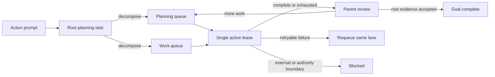

# Two-Queue Hierarchical Goal Controller

The goal controller turns an action request into a bounded execution state machine. It owns exactly
two ready queues:

- **Planning queue:** decomposition, prerequisite discovery, failure recovery, and parent review.
- **Work queue:** concrete leaf execution and verification.

The agent loop leases one task at a time. When both queues are ready, it alternates lanes. This
keeps planning responsive without allowing repeated replanning to starve execution.



## Runtime Behavior

When there is no active goal, interactive and one-shot modes promote a clear action prompt into a
goal. Informational prompts such as “What is runtime dispatch?” remain ordinary single-turn
requests. `DSCO_AUTO_GOAL=1` forces promotion and `DSCO_AUTO_GOAL=0` disables it.

The first lease is always a root planning task. The root cannot complete until it has been
decomposed. A planning task may create bounded `plan` and `work` children. A parent returns to the
planning queue only after all its children are terminal, giving it an explicit review/replan step.
The controller holds at most 32 tasks, depth 8, 12 children per parent, and 8 children per
decomposition call. Planning tasks default to eight leases. A decomposition is accepted only when
one later lease remains for parent review, keeping recovery bounded and restart-safe.

Work and planning tasks accept these transitions:

| Transition | Required data | Effect |
|---|---|---|
| `decompose` | leased planning task, 1–8 typed children | parent waits; children enter their queues |
| `checkpoint` | new concrete evidence | retains the active lease and records progress |
| `complete` | acceptance evidence; terminal children if any | closes task, wakes parent, and atomically commits a verified root |
| `fail` | failure evidence and reason | retries within its budget, then returns failure to parent |
| `block` | boundary evidence and exact reason | closes leaf for parent recovery or blocks the root |

`self_exit` only ends the current model loop. It never marks an active goal complete. In the
interactive runtime, an unfinished goal queues its next autonomous step unless the operator set
`DSCO_GOAL_NO_AUTORUN=1`.

## Model Tool Contract

Three core tools expose the controller:

- `get_goal {}` returns goal state, budgets, evidence, queue counts, and both revisions.
- `goal_queue` reads or mutates the leased task. Every mutation needs the exact `task_id` and
  controller `revision`; stale, duplicate-field, and unknown-field requests fail. Evidence is
  capped at 511 UTF-8 bytes and reasons at 255 bytes. Those limits are advertised in the model
  schema, and rejected mutations return the current revision and lease so the model can repair the
  call without an extra status request. Successful mutations return a compact receipt; `status`
  remains the full tree view.
- `update_goal` records goal evidence or sets `complete`/`blocked`. A terminal update needs the
  exact goal revision and is rejected until the controller root has the matching terminal state.
  Normal root transitions commit the matching goal state atomically, saving a model round trip;
  `update_goal` remains the guarded recovery path for a terminal root loaded from a session.

These calls use the normal tool registry and `tools_execute_for_tier()` gate. They mutate bounded
in-memory session metadata and do not grant filesystem, network, execution, secrets, or control
capabilities. Actual work still uses governed tools with their real capability classifications.

## Agent Quick Start: Avoid Rejected Calls

Use the controller only when a goal is active. If `goal_queue` reports
`no active hierarchical goal queue`, continue the authorized task normally; do not invent a goal
or task ID merely to record completion. When a controller context is supplied, it identifies the
**currently leased task** and **controller revision**. Use those values; call `{"action":"status"}`
only when state is missing or unclear. Status reads state; it does not lease a task.

### Exact fields per action

The tool schema lists the union of all fields, **not fields accepted by every action**. Unknown,
extra, duplicate, null, or empty placeholder fields are not a way to omit a field.

| Action | Send exactly these top-level fields |
|---|---|
| `status` | `action` |
| `decompose` | `action`, `task_id`, `revision`, `children` — **no `evidence` or `reason`** |
| `checkpoint`, `complete` | `action`, `task_id`, `revision`, `evidence` |
| `fail`, `block` | `action`, `task_id`, `revision`, `evidence`, `reason` |

Children require `title` and `lane` (`work` or `plan`); give each measurable `acceptance` as well.
Use one `work` child for a simple task. Use `plan` only for a branch needing further decomposition.
Omit `max_attempts` unless a different bound is necessary: work defaults to 3 leases and plan to 8;
plan must allow at least 2 for decomposition plus review. A call accepts 1–8 children. Siblings
are not dependency-ordered: keep dependent steps together in one work child or create the next
step during parent review. Do not create speculative children beyond remaining capacity/budget.

### Smallest successful sequence

**Root plan → work child → root review.** Root completion requires prior decomposition, even for
one-step work. If the requested operation already succeeded, make the child verify its existing
artifact; do not repeat a capture, send, payment, or other side effect just to satisfy bookkeeping.

The IDs/revisions below illustrate a fresh queue; **copy the actual values from each new lease,
not these example numbers**:

1. Root planning lease says task `1`, controller revision `3`. Send:
   ```json
   {"action":"decompose","task_id":1,"revision":3,"children":[{"title":"Capture and verify the requested window","lane":"work","acceptance":"A valid PNG captures only the identified window"}]}
   ```
2. The receipt has `current_id: 0` and revision `4`. This is normal, not a blocker. The next model
   request leases the work child, here task `2` at revision `5`. Perform the governed capture and
   inspect the actual PNG, then send:
   ```json
   {"action":"complete","task_id":2,"revision":5,"evidence":"Window-only PNG saved at /tmp/window.png; dimensions and target window verified."}
   ```
3. The receipt again releases the lease. On the next request, the root is selected for review,
   here task `1` at revision `7`. Check child evidence against the user's full request, then send:
   ```json
   {"action":"complete","task_id":1,"revision":7,"evidence":"Verified child artifact satisfies the window-only capture request; saved path is ready to report."}
   ```
4. The public tool atomically marks the session goal complete and returns its state. Report the
   outcome. **Do not call `update_goal` again in the normal path.** A restored terminal root whose
   session goal is still active is the exceptional recovery case: inspect `get_goal` first.

Serialize transitions. Never batch `decompose` with a guessed child completion, infer child IDs,
add one to a revision, or use `get_goal`'s top-level **goal revision** as the controller revision.
A mutation and the following lease each advance the controller revision. `checkpoint` is the
exception to lease release: it retains the current task while advancing revision. A receipt is
current when returned; a later model request may supply a newer lease/revision.

### Evidence and recovery

- Evidence must contain 1–511 UTF-8 **bytes**; reason 1–255, without control characters. Use short
  observed outcomes and artifact paths, not logs, intentions, or unsupported success claims.
- Use `checkpoint` only for meaningful new evidence, not to keep a loop alive. Use `fail` for an
  observed failed attempt and `block` for an evidenced authority/resource boundary with the
  smallest missing input. A malformed tool call is not a failed task or an authority blocker.
- On rejection, inspect the error and returned `current_id`/`revision`; remove the invalid fields
  or repair the stale values. Do not repeat an unchanged call. If a newer context selects a
  different task, reassess that task rather than submitting old evidence under its ID.
- `current_id: 0` immediately after a transition means the next request must acquire the lease;
  repeated `status` calls cannot do that. Do not mutate an unleased task or claim a blocker merely
  because no task is leased between requests.
- Failed/blocked children being terminal only makes the parent eligible for review; it does not
  prove acceptance. Recover unmet criteria within bounds or report a real boundary. Complete the
  parent only when its acceptance is actually verified. Do not re-decompose verified work.

## Persistence and Recovery

Session JSON stores the objective fingerprint, task tree, retry counters, queue revision, goal
revision, limits, and evidence. Saving during a lease is safe: loading requeues that task and bumps
the controller revision so an in-flight stale mutation cannot be accepted after recovery.

The loop stops only at a verified terminal state or a bounded condition: token budget, request
limit, three response boundaries without a controller transition, operator pause, interruption, or
a concrete root blocker. `/goal resume` starts a fresh bounded request segment while preserving
durable token accounting and the task tree.

## Operator Controls

```text
/goal <objective>             start or replace a goal
/goal                         show goal and queue summary
/goal queue                   print both queues and the task tree as JSON
/goal criteria <text>         set root acceptance criteria and replan
/goal budget <N|80k|1.5m>    set token ceiling
/goal turns <N>               set request ceiling for a segment
/goal pause|resume|clear      control execution
```

Startup controls are `DSCO_GOAL`, `DSCO_AUTO_GOAL`, `DSCO_GOAL_TOKEN_BUDGET`,
`DSCO_GOAL_MAX_TURNS`, and `DSCO_GOAL_NO_AUTORUN`. Budget and turn limits apply whether the
objective came from `DSCO_GOAL`, `/goal`, or automatic prompt promotion.

## Verification

`make test-goal-queue` runs the controller under AddressSanitizer and covers fair lane selection,
nested decomposition, retries and fallback, root invariants, blocking, stale revisions, strict
JSON, and crash requeue. The integrated test runner additionally proves goal completion through
the public governed tool path and checks the auto-start classifier, startup limit propagation, and
request context. `make test-goal-controller-binary` drives the real binary through an owned local
OpenAI-compatible fixture and verifies both the request boundary and transmitted schema.
