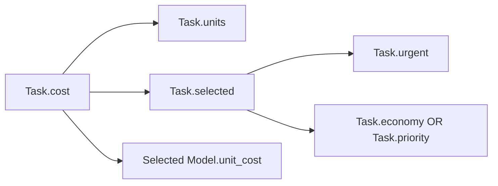

# Lingo 0.2 — the language of Distributed Systems

Status: executable language definition, September 10, 2026. The object/value/scenario core and native tool bridge run in this checkout. [Shared platform classes](LINGO_PLATFORM.md), source-bound [named worlds and value addresses](lingo/WORLDS.md), and GraphSub stored-world publication/reopening are implemented. Embedded DSCO, Autobot, GraphSub and Chimera modules support [cross-system scripting and routing preferences](lingo/SYSTEMS.md). The Python SDK invokes this same native host. The [interactive workbench](lingo/WORKBENCH.md) adds owned local sessions, typed scenario controls, dependency inspection and saved selections. [Workflow definitions and durable Autobot receipts](lingo/WORKFLOWS.md) connect calculations to bounded execution and reconciliation. Eligible Chimera plans support explicit single-attempt inference with plan-change rejection. MVCC workspaces, shared calculation caches, resumable distributed workflows and distributed value evaluation remain target integrations.

Start with the [company-wide language definition](../../LINGO.md) for Lingo's role corresponding to Slang, GraphSub's role corresponding to SecDB, and DSCO's role corresponding to SecView. [DSCO as the primary operator for GraphSub](DSCO_GRAPHSUB_OPERATOR.md) describes the complete target operator. This page defines the executable 0.2 core; broader operator examples remain explicitly identified as target bindings.

Lingo lets a person or agent describe a world of objects, ask those objects for calculated values, explore alternative assumptions, and explicitly interact with DSCO. It uses LuaJIT as its execution engine and ordinary Lua 5.1 syntax. Its distinctive semantics live in the object and value runtime.

[Live IPC and event replay](LINGO_IPC.md) exposes instrumented world, governance,
tool, provider, and swarm events from a native Lingo run through a durable journal
and an ordered Unix socket stream. `scripts/lingo_stream.py` launches a program,
receives live events, and checks them against the committed journal.

The useful inheritance from SecDB/Slang is **a shared vocabulary of objects whose values know how to calculate themselves**. A script can ask for a result without manually scheduling every prerequisite. The runtime discovers the actual reads, caches successful results, and invalidates consumers when an input changes. Scenario scopes temporarily replace values. Commands perform real interactions under DSCO authority.

The supplied notes are private OCR/transcription material, with mistakes and unrelated pages. [The source map](lingo/SECDB_SOURCE_MAP.md) distinguishes observations from our design decisions. [The corpus index](lingo/corpus-index.json) inventories all 206 supplied files without copying their contents.

## 1. The relationship between language, runtime and world

| Layer | Responsibility | Current implementation |
|---|---|---|
| LuaJIT | Parse source; execute functions, expressions and control flow | Embedded LuaJIT 2.1; portable Lua 5.1 source profile |
| Lingo | Objects, types, calculated values, dependencies, scenarios, addresses and stored worlds | `lingo/runtime.lua`, `lingo/world_io.lua`, private native source identity |
| Platform vocabulary | Observation, Service, Object, Artifact, Policy, Task, Run, Model and Agent | `lingo/platform.lua`, one embedded definition source |
| DSCO | Tool registry, authorization, execution, existing tool telemetry | `src/lingo.c` calls `tools_execute_for_tier()` in the same process |
| GraphSub operator | Live native object reads, pages, health and dynamic schema catalog | `lingo/operator.lua` through governed `graphsub_operator`; no pinned snapshots or writes |
| Autobot | Exact remote contracts and application-checked tool execution | `lingo/autobot.lua`, native discovery and the existing Tool Management client |
| Chimera | Per-request routing preferences and actual route decisions | `lingo/chimera.lua`, `chimera_route`, and the existing Router `/v1/route` implementation |
| Stored-world artifacts | Exact stored values and source manifests, content verification and restart reopening | `lingo/workspace.lua` through native `graphsub_world`; new `State` artifact per publication |
| Shared calculation context | MVCC, conditional commits, changefeeds and accepted distributed results | Target bindings; browsing and artifact publication do not imply these guarantees |

Each `run` or `eval` invocation has a fresh VM and one or more private semantic worlds. `open` retains that VM for bounded workbench commands until the session closes. References have stable identity within a world. `lingo.operator` attaches a live browse scope to an existing GraphSub engine and returns explicit observations. Separately, `lingo.workspace` publishes stored-world images and reopens them into an empty world with compatible definitions. Host tool calls interact with the actual DSCO runtime; reopening a world or saved workbench reconstructs stored objects and explicit overrides, not a suspended VM or remote workflow.

LuaJIT is compatible with Lua 5.1; we choose that common syntax instead of requiring recent syntax extensions. The host accepts text chunks only. See [LuaJIT extensions](https://luajit.org/extensions.html) and the [Lua 5.1 reference manual](https://www.lua.org/manual/5.1/manual.html).

## 2. What a script looks like

Run the complete example:

```sh
./dsco lingo run examples/lingo/routing.lingo
```

Its core declaration is:

```lua
local l = require("lingo")
local w = l.world()
local t = l.types

w:define("Model", {
  unit_cost = l.stored(t.integer),
})
w:define("Task", {
  units = l.stored(t.integer),
  urgent = l.stored(t.boolean, false),
  economy = l.stored(t.ref("Model")),
  priority = l.stored(t.ref("Model")),
  selected = l.derived(t.ref("Model"), function(self)
    if self.urgent then return self.priority end
    return self.economy
  end),
  cost = l.derived(t.integer, function(self)
    return self.units * self.selected.unit_cost
  end),
})
```

These costs are illustrative units, not provider prices. Create two models with unit costs 2 and 7 and a task requiring 100 units. `task.cost` is 200. Temporarily override `urgent` to true and the same expression becomes 700. Exit that scenario and it is 200 again. Set the economy model's cost to 3 in the base world and the next read becomes 300.

There is no hand-written list of calculation dependencies. Executing `self.selected.unit_cost` records a read of the chosen reference and a read of that model's price.



Arrows mean “reads.” Invalidation moves in the reverse direction. The `OR` is resolved by the actual branch taken; it is not an instruction to read both models.

## 3. Language contract

A `.lingo` file is a Lua source chunk. Lua provides lexical local variables, functions and closures, tables, loops, conditionals, arithmetic and ordinary function calls. Names are case-sensitive. We do not adopt Slang's case-insensitive names, spaces in identifiers, global variable scopes or separate parser.

The entry point is `require("lingo")`. A script may read its JSON input record from `args`, print bounded diagnostic output, and return one JSON-compatible value. An absent return becomes JSON null. Local variables retain Lua's dynamic typing. Lingo checks types at graph boundaries.

| Construct | Meaning |
|---|---|
| `l.world({id=...})` | Create an isolated named object universe and base evaluation context |
| `w:define(name, fields, options)` | Register a class once in that world |
| `l.stored(type, default)` | A base input with an optional initial value |
| `l.derived(type, fn, options)` | A value calculated from actual graph reads |
| `w:new(class, id, values)` | Create an object with an immutable, unique ID |
| `w:ref(id)` | Resolve an existing ID in this world |
| `object.field` | Read a parameterless value through the graph |
| `w:get(object, field, args)` | Read a value, including named calculation arguments |
| `w:set(object, field, value)` | Change a stored base input and invalidate consumers |
| `w:objects(class)` | Sorted class membership; a tracked read inside calculations |
| `w:scenario(name, fn)` | Enter a temporary overlay, execute callback, unwind |
| `w:override(object, field, value, args)` | Replace a stored or calculated value in the active scenario |
| `w:restore(object, field, args)` | Remove this scenario's override; reveal outer/base semantics |
| `w:why(object, field, args)` | Inspect current dependency and cache information |
| `w:describe(object)` | Inspect identity, class version, fields and object revision |
| `w:events(after, limit)` | Read bounded graph events with a sequence cursor |
| `w:manifest()` | Inspect registered class/source/runtime identities |
| `w:address(object, field, args)` | Export a portable logical value address |
| `w:read(address)`, `w:explain(address)` | Read or inspect through the same dependency engine |
| `w:snapshot()` | Export stored values, typed references, revisions and definitions |
| `w:load(snapshot)` | Atomically reconstruct stored objects into an empty declared world |
| `l.call(tool, arguments)` | Explicitly invoke an existing DSCO tool |
| `l.try(fn)` | Return `ok, value_or_error`; budget exhaustion remains terminal |
| `l.encode(value)`, `l.decode(text)` | Strict JSON conversion |
| `l.array{...}`, `l.null` | Preserve an empty JSON array or JSON null |

The API namespace is read-only. Worlds and object references expose private userdata handles. Direct assignment to an object field is rejected. Stored data and returned compound values are copied so mutation of a Lua table cannot silently bypass invalidation.

### Types and contracts

Primitive types are `number` (finite), `integer` (exact, within ±9,007,199,254,740,991), `string`, `boolean` and `json`. Composite descriptors are:

```lua
l.types.ref("Model")
l.types.list("integer")
l.types.record {name="string", tokens="integer"}
l.types.optional("string")  -- value is a string or l.null
```

A reference must belong to the same world and exact declared class. Lists use dense 1-based indices. Records reject extra fields and missing required values. Optional means explicit null, not a silently missing field. Graph JSON values cannot contain object handles or functions. Use `w:describe(ref).id` when exporting identity.

```lua
w:interface("Named", {name="string"})
w:define("Artifact", {name=l.stored("string")}, {
  implements={"Named"}, version="1",
})
```

Interfaces validate the declared field types. They do not provide inheritance, dispatch over interface references, or full parameter-signature subtyping. Class replacement is rejected. `version` is descriptive metadata; native source and deterministic function-prototype hashes separately bind the actual definitions. `{immutable=true}` rejects base-field mutation. Source identities are not signatures or a migration system. See [world identity and loading](lingo/WORLDS.md).

### Parameterized values

```lua
scaled = l.derived("integer", function(self, ctx, arguments)
  return self.units * arguments.factor
end, {params={factor="integer"}})

-- Once this field has been defined on a class:
local value = w:get(task, "scaled", {factor=3})
```

Each named-argument combination has its own cache entry. Argument order does not affect identity. Unknown and missing arguments fail. Defaults for calculated arguments are not implemented.

## 4. How the calculation engine works

For this runtime, a node is identified by:

```text
(world, scenario context, object ID, field name, canonical arguments)
```

Class definitions are immutable during a run, so code version cannot change underneath these entries. A future shared cache must additionally identify immutable source, schema, input snapshot and relevant policy versions.

Reading a derived node follows this algorithm:

1. Record the read in the currently evaluating parent's temporary read set.
2. Resolve an override from the innermost scenario outward. An override supplies the result directly.
3. If the node is already being evaluated, report a dependency cycle.
4. Return a valid memoized result if one exists.
5. Otherwise evaluate the function under dependency capture, then validate its result type.
6. Replace its previous dependency edges with the actual reads from this attempt. This removes dependencies belonging to an old branch.
7. On success, store the value and mark it valid. On failure, keep it invalid, retain the observed edges and error, and propagate the error. Never return a previously successful result as if it were current.

A stored write first validates and compares the new value. Equal values are a no-op. A changed value updates the object revision and marks every reachable consumer invalid. It does not eagerly recalculate them. The next demand performs the necessary calculations.

For a branch `if task.urgent then ...`, the read of `urgent` is itself a dependency. Changing the selector invalidates the decision, causing the new branch's dependencies to be discovered. Changing only the unused model does not invalidate the current result. This relies on branch conditions also being graph inputs; hidden mutable closure state is outside this guarantee.

`w:ref(id)` records an identity-presence dependency, including failed lookups that a calculation handles with `l.try`. Creating that previously missing object invalidates its consumers.

`w:objects("Artifact")` records a class membership dependency. Creating another object of that class invalidates consumers of that query, even if none of its fields has been read yet. A future storage adapter must capture predicate/index revisions for richer queries too.

`cache="none"` skips reuse of that derived node's own cached result. Its callers can still cache their results because the calculation contract remains pure. This is a retention choice, not a mechanism for polling changing external state.

### Purity is a defined contract with partial runtime enforcement

A calculated function computes its own value. The runtime rejects graph mutation, scenario creation, cross-world graph reads and DSCO calls during calculation. Current time, randomness, provider responses and filesystem contents must enter as explicit observations outside the calculation.

Lua closures can still mutate private upvalues. The reference runtime does not prove referential transparency or prevent every local Lua mutation. Treat purity as a reviewed programming contract. Do not cache a function that reads mutable hidden state, or interpret the current host as a process security boundary for hostile programs.

## 5. Scenarios: the useful meaning of a “diddle”

A scenario changes the meaning of a read in a temporary context. It does not write a stored base value, save a database object or execute an action.

```lua
local possible_cost = w:scenario("priority service", function(s)
  s:override(task, "urgent", true)
  return task.cost
end)
```

Each context holds a sparse override map and a separate, lazily populated cache. Base stored data is shared for reads. Derived cache entries are not borrowed from another context, avoiding accidental reuse of a baseline result under changed assumptions. Nested contexts search their own overrides first, then their ancestors.

An override on a calculated node replaces its computation and removes its dependencies on lower inputs. With `B = A + 2` and `C = B + 4`:

| Operation in a scenario | A | B | C |
|---|---:|---:|---:|
| Start | 1 | 3 | 7 |
| Override A to 100 | 100 | 102 | 106 |
| Override B to 200 | 100 | 200 | 204 |
| Override A to 2 | 2 | 200 | 204 |
| Restore B | 2 | 4 | 8 |
| Exit scenario | 1 | 3 | 7 |

[The executable example](../examples/lingo/diddles.lingo) also checks nested overrides. Restoring an inner override reveals an outer override if one exists. It does not remove all ancestors' overrides. Callback exit restores the prior context on success or ordinary error. Values returned from a scenario are ordinary results; returning a reference does not pin that reference to the expired scenario.

Base mutation and **all** DSCO interactions are forbidden inside a scenario, including read-only host tools. This keeps scenarios dependent on the same explicit observations as their baseline. Collect external observations first, then compare scenarios, then act explicitly outside the scenario.

## 6. Scripting real DSCO interactions

The implemented bridge is deliberately one generic operation:

```lua
local l=require("lingo")
local response=l.call("read_file", {path=args.input})
assert(response.ok, response.result)
```

Its receipt is:

```lua
{ok=true_or_false, tool="read_file", result="existing tool's text", sequence=1}
```

The `ok` flag is the existing tool's success result. `result` is preserved as text; JSON-producing tools may be decoded explicitly when their contract says so. Lingo does not infer success from fluent prose or automatically retry actions. Unknown tool names and capability denials return failed receipts. A script decides whether to stop, handle the result or request another authorized action.

Every bridge call passes through `tools_execute_for_tier()` using the enclosing call's execution tier. Calls run in the same DSCO process, preserving session flow taint and the runtime's existing execution records. Starting a new CLI subprocess for every tool would lose that important context, so the host does not use that design.

The pattern is:

```text
explicit tool/model interaction
    -> observation stored in the world
    -> calculated values and scenario comparisons
    -> explicit authorized action
    -> action result recorded as another observation
```

[The file review example](../examples/lingo/file-review.lingo) reads a real file through DSCO, stores the returned response, computes its size and optionally writes a summary through DSCO. Its result clearly measures the tool response, not the underlying file's bytes.

The same bridge can use tools available to the current host for buffers, plans, tool discovery or agent orchestration, according to their actual schemas and permissions. Merely naming a model or an agent object does not invoke a provider. The initial CLI uses DSCO's local tool registry; it does not automatically discover remote MCP servers. Inside a running DSCO host, registry availability follows that host's configuration.

### Object vocabulary for DSCO

`require("lingo.platform")` now supplies the following shared contracts. The [complete platform reference](LINGO_PLATFORM.md) gives exact fields and defaults.

| Object | Stored observations | Useful calculated values |
|---|---|---|
| Observation | Origin, observation time, consistency, immutable payload | Provenance summary |
| Service | Observation, explicit availability and enabled state | Local readiness and advisory summary |
| Object | Service, opaque remote ID, observation | Observed payload |
| Model / Agent | Service, external identity and observation | Associated service readiness |
| Task | Service/policy references, operation, inputs, cost/call estimate | Budget fit, readiness, eligibility and advisory summary |
| Artifact | Locator, claimed hash and observation | Evidence summary; verification remains explicitly external |
| Run | Task, observation, remote ID and recorded state | Terminal-state classification and summary |
| Policy | Effect-planning choice, cost and call limits | Local planning validity |

These classes are declared when `p.world{id=...}` runs. They make no service calls. Authority remains in DSCO's gate; a script returning `eligible=true` cannot grant itself capabilities. Remote results enter as explicit observations. Session/buffer abstractions, richer acceptance contracts, measured model-quality calculations and durable workflow state can be added through further domain libraries.

## 7. Inspection, errors and reproducibility

`why`, `describe` and `events` are available outside value calculations; inspection metadata cannot become an untracked calculation input.

`why` reports unread/valid/invalid state, actual immediate dependencies, scenario name, evaluations, cache hits, invalidation count, override status and the latest calculation error. It does not run the calculation or reconstruct a complete historical proof. Recurse over its dependency records to inspect a larger graph.

`describe` reports object and class metadata. Graph events retain at most 4,096 entries; queries return at most 100 and indicate when a cursor has fallen behind retention. These are process-local diagnostics, separate from DSCO's durable execution telemetry.

The native result contains API version, execution profile, source SHA-256, tool-call count, script return value and captured print output. World manifests additionally carry embedded runtime and definition identities. Neither alone is a complete execution certificate: retain arguments, stored-world artifact, relevant tool/schema versions, provider route and actual observation/effect receipts for that stronger claim.

Regression checks should assert semantics, including branch pruning, transitive invalidation, scenario unwinding and failure behavior. A blessed output is an explicitly accepted baseline with provenance and a comparison policy. It must not become a synonym for whatever the latest run returned. The included tests are executable conformance checks; no baseline registry or blessing UI is implemented.

## 8. Native execution profile and limits

```sh
./dsco lingo eval 'return 6 * 7'
./dsco lingo run examples/lingo/routing.lingo
./dsco lingo run examples/lingo/file-review.lingo '{"input":"README.md"}'
./dsco lingo check examples/lingo/routing.lingo
./dsco --tool-exec lingo '{"source":"return 42"}'
```

`check` only compiles source. It does not execute declarations, validate class contracts, check tools or prove purity. Running a script is capability-classified as execution plus filesystem read; nested tools are checked independently. An explicit execution grant can admit a script at an untrusted tier without granting its nested tools write, network or control authority. The native `lingo` tool is also available through the normal tool registry, including MCP when that toolset is enabled.

The host exposes selected base functions, `string`, `table`, deterministic `math` operations and `bit`. It omits ambient `io`, `os`, `ffi`, `debug`, `package`, dynamic loaders, environment mutation, raw metatable access, `pcall`/`xpcall`, coroutines and random functions. Supported imports are `lingo`, `lingo.platform`, `lingo.workspace`, `lingo.dsco`, `lingo.autobot`, `lingo.graphsub`, `lingo.operator` and `lingo.chimera`. Use `l.try` for recoverable exceptions; it cannot swallow an exhausted execution budget.

| Resource | Bound in the reference host |
|---|---:|
| Source text | 256 KiB |
| Lua-managed allocations | 32 MiB |
| Executed VM instructions | Approximately 5 million, checked every 1,000 |
| Host tool calls | 100 |
| Captured print output | 64 KiB |
| Encoded/decoded JSON | 256 KiB, with structural limits |
| Tool result buffer | 256 KiB per call |

These limits do not impose a wall-clock deadline on native tools, include all native DSCO allocations, or undo completed effects after a later script error. There is no transaction spanning `l.call` operations. Existing tool-specific timeouts and output truncation still apply.

This profile uses LuaJIT with machine-code compilation disabled to keep VM instruction accounting effective. It does not claim JIT throughput. A later trusted-kernel profile can enable compilation with process supervision and separate admission limits. That profile needs its own validation.

On the tested macOS arm64 installation, LuaJIT's external unwinder fails across PAC-signed host C return addresses. The build retains BTI but omits PAC for the Lua host callback modules `lingo.c` and `lingo_origin.c`; other DSCO modules retain their existing flags. A minimal C probe reproduced the failure, and live tests verify recoverable callback errors. See [LuaJIT's unwinding implementation](https://github.com/LuaJIT/LuaJIT/blob/v2.1/src/lj_err.c). This is a local compatibility finding, not a claim that every LuaJIT/arm64 build has the issue.

LuaJIT is detected with `pkg-config luajit`. Without it, DSCO builds a stub reporting the missing dependency. The runtime source is embedded from `lingo/runtime.lua`; a script's working directory cannot replace it.

## 9. Extensions with explicit semantic requirements

### Persistent world and GraphSub

The [stored-world adapter](lingo/WORLDS.md) now preserves object identities, stored references, revisions and exact definitions through content-verified GraphSub artifacts. It passes actual engine restart tests. Extending it to a shared mutable workspace needs snapshot-consistent reads, object and query/index revisions, and compare-and-swap transactions. A script's local stored edit and a database publication remain different operations, as the notes distinguish `SetValue` from `UpdateSecurity`.

A commit should validate the captured read set, atomically publish writes and a transaction receipt, then deliver versioned invalidation events. Concurrent conflicting writes fail or retry explicitly. Cache validity must be supported by input revisions or a complete invalidation stream. A disconnected worker must not keep serving a supposedly current value merely because it missed an invalidation message.

Scenario overlays remain non-persistent. Publishing a hypothetical value requires an explicit chosen result and a new authorized transaction; exiting a scenario never commits it.

### Durable workflows

Keep a workflow's execution graph separate from the value dependency graph. The former records attempted actions and waits; the latter records which inputs a calculation read.

The implemented `require("lingo.workflow")` binding constructs immutable definitions with up to 16 ordered steps, backward dependencies and exact input mappings. `definition:execute{inputs=...,idempotency_key=...}` submits to Autobot's opt-in `lingo.v1` composition profile. It records a full-definition/input hash, reserves the retained key atomically, journals issued remote calls, enforces deadlines and stops on failure. `read(execution_id)` reads retained detail; `reconcile(idempotency_key)` looks up a lost response without resubmitting. A key is protected while its execution record is retained. Absence after retention does not prove that work never ran. See [the workflow contract and release desk](lingo/WORKFLOWS.md).

These are synchronous bounded executions with durable evidence. They do not resume an interrupted worker or make remote effects exactly once. Inspection and scenarios cannot submit workflows. Domain acceptance is a separate calculated value over recorded results; a completed execution does not establish acceptance.

A durable action needs workflow/run/step IDs, source and input hashes, principal and capability references, target, timeout, idempotency key and an outcome receipt. Before dispatch, journal the intent. On restart, reconcile an uncertain outcome with the actual target before retrying. At-least-once delivery is not exactly-once effect execution.

Checkpoints store explicit JSON state plus the next named step and pinned source version. They do not serialize arbitrary Lua stacks, closures or C pointers. Human review becomes a persisted wait state. A new source version starts new work; existing runs resume their pinned version or undergo an explicit migration.

Earlier architecture notes proposed `workflow`, `ctx:model`, `ctx:approve`, `ctx:accept` and similar syntax. The callable workflow API is specifically `lingo.workflow`; the earlier context methods and automatic checkpoint/resume semantics remain proposals.

### Native kernels, interactive sessions and agent generation

Native kernels should register schemas and versions under the same object/value interface as Lua calculations. Raw FFI is not the public escape hatch. A pure kernel must have an enforceable input/output contract; an effectful kernel uses DSCO's dispatch boundary.

The [workbench](lingo/WORKBENCH.md) retains a bounded VM in one DSCO process, renders typed values, follows their dependencies and changes declared scenario controls. A saved selection reconstructs the world and explicit overrides under the same source and compatible runtime. Arbitrary expression-console evaluation and shared base commits remain future bindings; current workbench commands do not introduce either operation.

An agent may generate `.lingo` source, but generation does not make that source authoritative. Syntax checks, contract checks, semantic fixtures and effect review must refer to the exact source version that is executed. Lingo provides an inspectable representation between a requested outcome and concrete runtime interactions.

## 10. Validation and implementation map

```sh
make dsco
make test-lingo
make test-lingo-session
make test-gate-claims
```

- `lingo/runtime.lua`: reference language semantics.
- `src/lingo.c`, `include/lingo.h`: bounded LuaJIT host and same-process DSCO bridge.
- `lingo/view.lua`, `src/lingo_session.c`, `src/lingo_workbench.c`: typed worksheets, owned session operations, source-bound saved selections, and the terminal/JSON client.
- `scripts/embed_lingo.py`: source embedding; no persisted bytecode dependency.
- `examples/lingo/`: routing, nested overrides and real file interaction.
- `tests/lingo_semantics.lingo`, `tests/test_lingo.py`: semantics, live effects, denials, JSON boundaries and exhaustion.

Stored-world adapters, platform classes, and local workbench sessions implement the first parts of this operator contract. Remaining integration work includes reusable admitted definition packages, shared conditional commits, and a faithful binding from calculated action proposals to existing execution owners.
