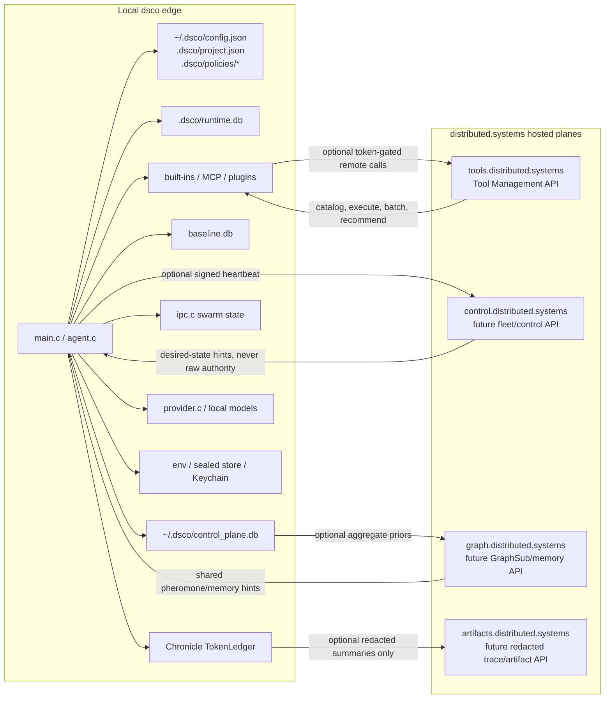
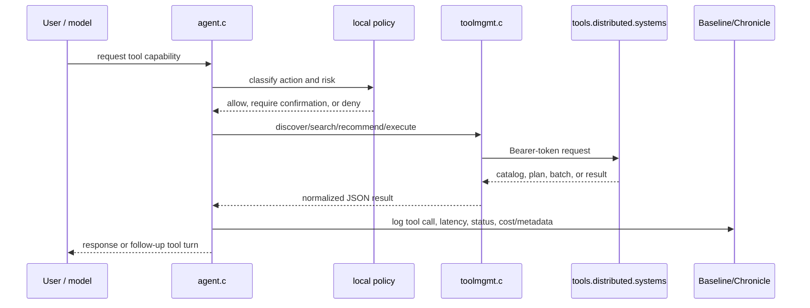
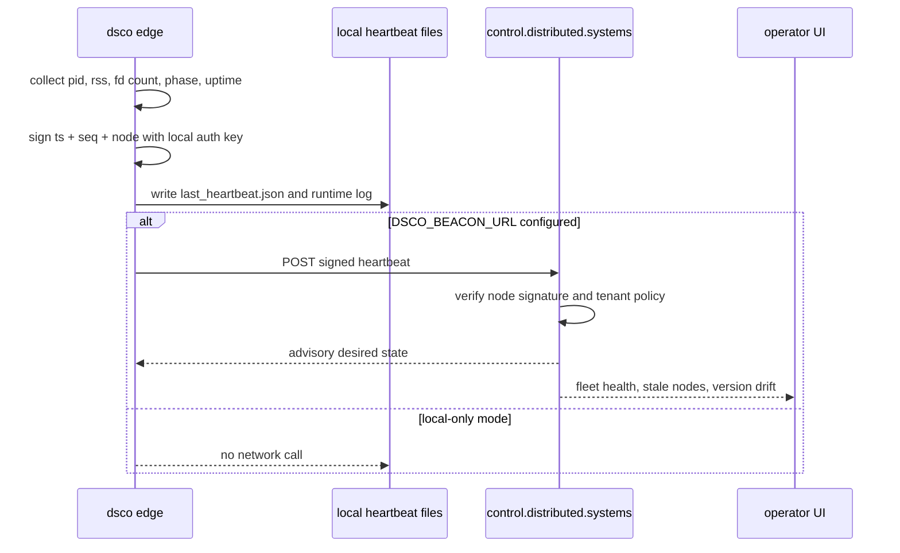
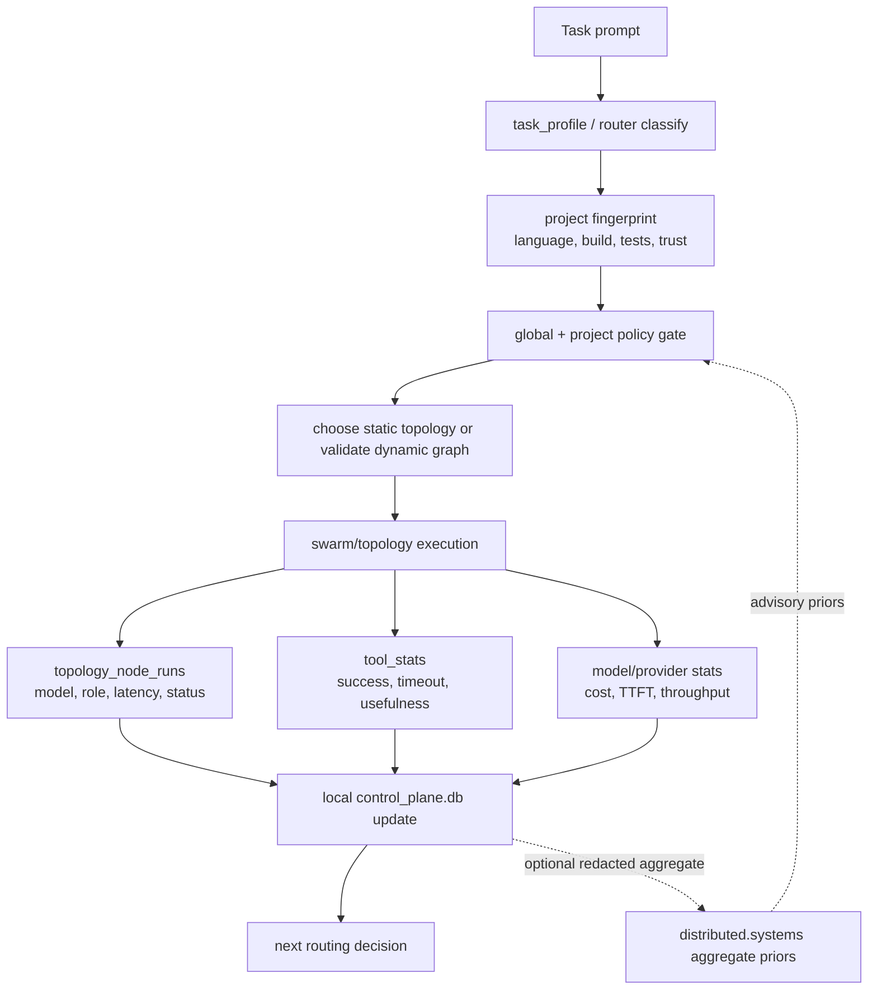
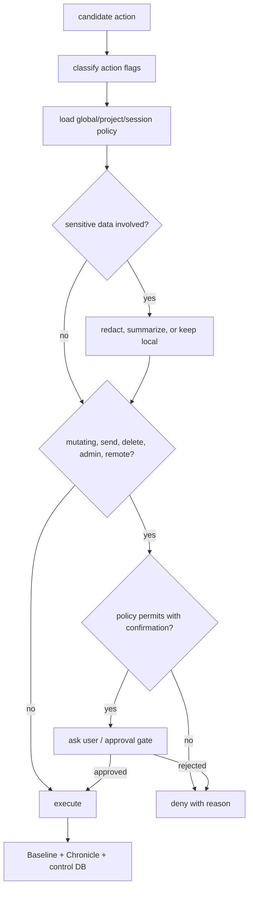

# Local Control Plane for dsco

## Purpose

`dsco` already has good execution primitives:

- human-editable workspace state in [`workspace.c`](../src/workspace.c)
- session and tool telemetry in [`llm.c`](../src/llm.c)
- event and trace persistence in [`baseline.c`](../src/baseline.c)
- inter-agent state in [`ipc.c`](../src/ipc.c)
- swarm process orchestration in [`swarm.c`](../src/swarm.c)

`dsco` is local-first, not local-only. When a hosted coordination surface is
useful, servers can be deployed under `distributed.systems`. The current
production example is `tools.distributed.systems`, which already acts as the
remote Tool Management API for discovery, execution, batching, recommendation,
durable jobs, and backend fan-out. Future hosted planes should follow the same
shape: keep local execution, secrets, policy, and audit state authoritative, and
use hosted services for coordination that benefits from shared availability.

What it does not yet have is a strong local control plane that learns per user, per project, per model, per topology, and per tool. That is the missing layer if `dsco` is going to become a genuinely optimized agentic CLI rather than just a capable tool-using chat loop.

This document defines the additional local data/configuration surfaces needed to support:

- fast static topology execution
- validated dynamic topology planning
- per-project model/tool routing
- cost and latency optimization
- safer autonomous execution
- better onboarding than Codex/Claude Code style systems

## Design Principles

1. Keep policy editable, keep telemetry queryable.
   Use Markdown or JSON for user-authored state. Use SQLite for learned runtime state.

2. Separate durable memory from transient execution state.
   Long-lived preferences should not be mixed with one noisy session.

3. Optimize by project, not just globally.
   The correct topology, model, and tool set depends heavily on repo shape and task mix.

4. Make routing explainable.
   If `dsco` auto-selects a topology or model, the decision should be reconstructable from local state.

5. Treat dynamic topologies as planned-and-validated graphs.
   Do not allow unconstrained graph generation with no stored validation context.

6. Make hosted control planes optional accelerators.
   `distributed.systems` services may provide shared catalogs, fleet health,
   durable remote jobs, and cross-node routing, but local policy must decide
   what can be sent, redacted, executed, or synchronized.

## Hybrid Edge/Cloud Architecture

The control-plane model is an edge runtime with optional hosted services. The
local `dsco` process remains the authority for execution and policy. Hosted
`distributed.systems` services provide shared availability, remote tools, fleet
coordination, and aggregate learning when the user enables them.



### Ownership Boundaries

| Surface | Local owner | Hosted owner | Rule |
|---|---|---|---|
| Source files and shell | `dsco` edge | none | Never execute remotely unless the user routes work to a remote tool or sandbox explicitly. |
| Secrets and credentials | env, sealed store, Keychain | none by default | Do not sync raw secrets. Hosted services receive bearer tokens only for their own APIs. |
| Tool catalog | local built-ins/MCP/plugin cache | `tools.distributed.systems` | Hosted catalog can extend tools, but local policy decides registration and execution. |
| Tool execution | local tools by default | remote tool plane when selected | Remote results are treated like external tool output and logged locally. |
| Policy | global/project JSON | optional signed policy snapshots later | Hosted policy can suggest, local policy gates. |
| Telemetry | Baseline, Chronicle, runtime DB | optional aggregate analytics later | Upload only redacted summaries or metrics by consent/config. |
| Fleet liveness | heartbeat local files | optional fleet API later | Remote fleet state is advisory unless the operator enables orchestration. |
| Memory | workspace/session memory | optional GraphSub-style sync later | Local memory is canonical; remote memory must carry sensitivity and consent state. |

### Current Hosted Tool Flow

`tools.distributed.systems` is the deployed hosted plane today. The local client
is [`toolmgmt.c`](../src/toolmgmt.c) and defaults to that host via
`TOOLMGMT_API_URL_DEFAULT`.



Operational notes:

- `DSCO_TOOLMGMT=1` enables remote tool registration in interactive startup.
- `TOOLS_API_TOKEN` or `AUTH_TOKEN` provides the bearer token.
- `TOOLS_API_URL` or `TOOL_MANAGEMENT_API_URL` can point to a staging plane.
- A missing token should degrade to local-only tools, not block normal DSCO use.
- Remote tool descriptions should carry action flags so mutating tools go
  through the same confirmation path as local/MCP tools.

### Future Fleet Heartbeat Flow

The existing heartbeat code already writes local runtime state and can POST to a
configured beacon URL. A hosted fleet plane should receive signed liveness and
return hints, not commands with unchecked authority.



The first fleet service should store only:

- node id, version, pid, uptime, phase, resource counters
- host class and build fingerprint
- active profile: `full`, `lite`, or `worker`
- stale/healthy/degraded status
- optional current task class, not prompt text

### Topology Feedback Loop

Topology selection should become a measured routing problem. The local runtime
executes and logs everything. Hosted services can aggregate coarse priors across
machines only after redaction and consent gates.



Important invariant: hosted priors can bias recommendations, but local trust,
budget, allowlist, and confirmation rules decide what actually runs.

### Policy Gate Flow

Every local, MCP, plugin, and hosted tool should pass through the same policy
shape before execution.



This keeps the hosted tool plane from becoming a bypass around local safety.

### Data Sync Policy

| Data class | Default | Hosted sync | Notes |
|---|---|---|---|
| API keys, OAuth tokens, private keys | local only | never | Keep in env, sealed store, Keychain, or provider-native stores. |
| Raw source files | local only | opt-in artifact upload only | Prefer hashes, file paths, language tags, and summaries. |
| User prompts | local only | opt-in redacted summaries | Chronicle already tracks sensitivity; use that as the sync gate. |
| Tool catalog metadata | remote pull allowed | yes | Catalog metadata is expected from `tools.distributed.systems`. |
| Remote tool results | local log | result already remote | Store result locally; redact before secondary sync. |
| Baseline events | local | aggregate metrics only | Good for latency, cost, status, not raw content by default. |
| Chronicle blobs | local | consented artifact export | Training examples must carry consent and redaction state. |
| Topology run stats | local first | aggregate allowed | Useful for shared routing priors without exposing code. |
| Failure signatures | local first | hashed aggregate allowed | Share signature hash, class, mitigation, not private stack traces. |
| Fleet heartbeat | local and optional remote | yes when enabled | Signed runtime counters, not conversation content. |

### Hosted Service Split

The services should stay small and separately replaceable.

| Service | Status | Responsibility | Local client |
|---|---|---|---|
| `tools.distributed.systems` | deployed | remote tool catalog, execution, batch, recommendation, durable jobs | `toolmgmt.c`, `connector.c` |
| `control.distributed.systems` | proposed | node registry, signed heartbeat, version drift, fleet desired-state hints | `heartbeat.c`, future `control_client.c` |
| `graph.distributed.systems` | proposed | shared pheromone graph, optional memory consolidation, topology priors | `graphsub_client.c` after hardening |
| `artifacts.distributed.systems` | proposed | consented trace/artifact snapshots, training candidates, replay bundles | `chronicle.c` export path |
| `auth.distributed.systems` | optional | first-party token issuance for hosted planes | setup/login layer |

Endpoint sketch:

```text
GET  /health
GET  /.well-known/oauth-protected-resource
GET  /api/v1/tools
GET  /api/v1/discover/search
POST /api/v1/tools/{tool}/execute
POST /api/v1/batch
POST /api/v1/orchestration/recommend

POST /api/v1/nodes/heartbeat          # future fleet plane
GET  /api/v1/nodes                    # future fleet plane
POST /api/v1/topologies/feedback      # future aggregate priors
GET  /api/v1/policy/snapshot          # future signed advisory policy
POST /api/v1/artifacts/redacted-trace  # future consented export
```

### Offline and Failure Modes

| Failure | Expected behavior |
|---|---|
| No network | Stay fully usable with built-ins, local providers, MCP, plugins, Baseline, Chronicle, IPC, and local memory. |
| Missing hosted token | Do not register remote tools; show setup hint only when the user asks for hosted tools. |
| Hosted 401 | Keep local tools active, surface auth status, do not retry indefinitely. |
| Hosted 429/5xx | Back off, circuit-break remote calls, continue local execution. |
| Hosted recommendation unavailable | Fall back to local tool discovery and topology priors. |
| Fleet service unavailable | Continue writing local heartbeat files and runtime logs. |
| Remote policy unavailable | Use last local policy or deny high-risk remote actions by default. |
| Redaction uncertain | Keep data local. |

## Recommended Storage Layout

Use four layers of local state.

### 1. User-edited global config

Path:

- `~/.dsco/config.json`

Use for:

- default model family
- fallback chain
- default topology mode
- cost ceilings
- trust defaults
- preferred providers
- TUI defaults
- MCP/plugin preferences

This is the equivalent of a clean, intentional version of `~/.claude.json`, but narrower and more explainable.

### 2. Project-local policy and onboarding

Paths:

- `.dsco/project.json`
- `.dsco/skills/`
- `.dsco/policies/`

Use for:

- allowed and denied tools for this repo
- project trust tier
- topology allowlist
- default topology for common task classes
- MCP context sources relevant to the repo
- example files and hot paths
- coding conventions and build/test commands
- repo-specific budget guardrails

This should be checked into the repo when it represents team policy, and ignored when it is purely local.

### 3. Global learned control database

Path:

- `~/.dsco/control_plane.db`

Use for cross-project learned behavior:

- per-model cost/latency history
- topology success priors
- tool reliability priors
- provider failure patterns
- terminal performance history
- onboarding summaries for visited projects

This is where the system should store the kind of fields shown in the pasted Claude config:

- `lastCost`
- `lastAPIDuration`
- `lastToolDuration`
- `lastModelUsage`
- `lastSessionMetrics`
- `exampleFiles`
- trust/onboarding flags

### 4. Project runtime database

Path:

- `.dsco/runtime.db`

Use for local, high-cardinality, project-scoped runtime data:

- topology executions
- node runs
- per-tool outcomes in this repo
- repo graph snapshots
- prompt/cache fingerprints
- artifact lineage
- dynamic planner traces

This is the right place for topology-aware scheduling state. It should not live only in process memory.

## Core Data Families

### A. Project Policy

Needed fields:

- `trust_tier`
- `allowed_tools`
- `blocked_tools`
- `default_model`
- `default_topology`
- `topology_auto_mode`
- `max_parallel_agents`
- `max_depth`
- `budget_per_session_usd`
- `budget_per_day_usd`
- `required_checks`
- `preferred_build_commands`
- `preferred_test_commands`

Why it matters:

- static and dynamic topologies need hard safety rails
- tool freedom should vary by repo risk
- this is the policy layer above the current session-level toggles

### B. Project Fingerprint and Onboarding State

Needed fields:

- repo root
- git remote(s)
- dominant languages
- build system
- test commands
- framework tags
- important directories
- generated example files
- onboarding complete flag
- onboarding summary

Why it matters:

- topologies should be chosen partly from repo shape
- tool ranking should know whether this is a C repo, monorepo, docs repo, infra repo, and so on

### C. Model and Provider Routing Memory

Needed fields:

- model family
- provider
- task class
- prompt size bucket
- topology used
- success rate
- average TTFT
- average total latency
- tokens per second
- average output tokens
- average cost
- timeout rate
- fallback rate

Why it matters:

- current `dsco` tracks session telemetry, but not reusable routing priors
- the scheduler needs to know when Sonnet beats Opus for a class of task in a given repo

### D. Tool Reliability and Affinity Memory

Needed fields:

- tool name
- task class
- repo class
- success/failure counts
- timeout counts
- average latency
- cache hit rate
- average output size
- downstream usefulness score
- prompt-following score

Why it matters:

- model routing is only half of optimization
- topology choice should be tied to which tools actually work well locally

### E. Topology Registry and Runtime Performance

Needed fields:

- topology name
- topology category
- execution kernel
- allowed edge types
- required node roles
- recommended task classes
- average total cost
- average wall time
- average API time
- success rate
- abort rate
- retry rate
- human override rate

Why it matters:

- you need empirical evidence to decide when `triage` beats `assembly_line` or `expert_panel`
- dynamic topology selection should be data-backed

### F. Node-Level Execution History

Needed fields:

- topology run id
- node id
- node tag
- role
- tier
- chosen concrete model
- input size
- output size
- start/end timestamps
- status
- retry count
- predecessor ids
- produced artifacts

Why it matters:

- dynamic topologies need node-level observability
- this is the minimum useful substrate for adaptive scheduling and postmortem analysis

### G. Dynamic Planner State

Needed fields:

- planned graph spec
- validation result
- chosen template or generated graph
- budget at plan time
- rationale summary
- route confidence
- branch decisions
- stop conditions
- failure policy

Why it matters:

- “dynamic topology” should mean validated plan plus execution trace
- without persisted planner state, failures will be opaque and hard to replay

### H. Prompt and Cache Intelligence

Needed fields:

- system prompt fingerprint
- workspace prompt fingerprint
- skill prompt fingerprint
- tool schema fingerprint
- repo context fingerprint
- cache write/read tokens
- compaction count
- summary reuse count

Why it matters:

- the pasted Claude metrics show cache creation and cache read dominating cost
- dsco should optimize prompt construction and reuse with explicit local memory

### I. MCP and Plugin State

Needed fields:

- server name
- command
- startup latency
- failure rate
- tool count
- auth state
- last healthy timestamp
- project affinity
- preferred contexts

Why it matters:

- external tool surfaces are part of the routing problem
- topology planners need to know which MCP backends are worth using

### J. UI and Terminal Performance State

Needed fields:

- frame duration distribution
- slow render percentile
- render mode
- terminal type
- feature toggles
- throughput during long streams
- topology panel render cost

Why it matters:

- this is an area where advanced CLIs often feel slow or unstable
- topology rendering should adapt to terminal performance, not just exist

### K. Failure Memory

Needed fields:

- failure signature hash
- tool or model involved
- repo class
- suggested mitigation
- auto-disable rule
- last seen
- resolved flag

Why it matters:

- repeated failures should change behavior locally
- this is one of the easiest ways to become more sophisticated than a stateless CLI

## Recommended Schema Direction

Use JSON for editable configuration and SQLite for learned state.

Suggested SQLite tables:

- `projects`
- `project_policies`
- `project_onboarding`
- `repo_snapshots`
- `model_stats`
- `provider_stats`
- `tool_stats`
- `tool_chain_stats`
- `topology_templates`
- `topology_runs`
- `topology_node_runs`
- `dynamic_plans`
- `mcp_server_stats`
- `plugin_stats`
- `cache_stats`
- `failure_memory`
- `session_summaries`
- `ui_perf_stats`

Suggested editable JSON files:

- `~/.dsco/config.json`
- `.dsco/project.json`
- `.dsco/policies/tools.json`
- `.dsco/policies/topologies.json`
- `.dsco/policies/budgets.json`

## Minimum High-Value Additions Beyond Existing dsco State

If implementation time is tight, add these first.

### Phase 1: Fastest useful additions

1. `~/.dsco/config.json`
   Add global defaults for model family, fallback chain, topology mode, and budgets.

2. `.dsco/project.json`
   Add project trust, tool allowlist, default topology, build/test commands, and important paths.

3. `~/.dsco/control_plane.db`
   Add project summaries, model stats, tool stats, topology stats, and session summaries.

4. `.dsco/runtime.db`
   Add topology runs, node runs, and planner traces.

### Phase 2: Makes topology execution smarter

1. Persist per-topology win rates and cost/latency.
2. Persist per-node output envelopes and routing decisions.
3. Add repo fingerprinting and example-file generation.
4. Add failure memory and automatic guardrail adjustments.

### Phase 3: Makes dynamic topology practical

1. Add dynamic plan validation and storage.
2. Add budget-aware scheduling.
3. Add provider-aware tier resolution.
4. Add recovery and replay of interrupted topology runs.

## Concrete Example

For a C repo like `dsco-cli`, the project-local config should be able to answer:

- Is this repo trusted?
- Which tools are always allowed here?
- What are the preferred test/build commands?
- Should code review default to `expert_panel` or `code_review`?
- Should debugging default to `clinic`?
- When should Sonnet be preferred over Opus?
- Which files are useful onboarding anchors?
- What was the cheapest successful topology for similar changes last week?

That is the level of local memory needed to make `dsco` feel optimized instead of generic.

## Recommended Implementation Sequence

1. Add `~/.dsco/config.json` and `.dsco/project.json`.
2. Add `control_plane.db` with `projects`, `model_stats`, `tool_stats`, `topology_runs`, and `session_summaries`.
3. Wire session closeout to persist a normalized summary, not just baseline events.
4. Add topology execution persistence into `.dsco/runtime.db`.
5. Add `/topology`, `/route`, and `/state` surfaces to inspect and override decisions.
6. Add dynamic planner validation only after static topology metrics are real.

## Bottom Line

To outperform Codex- or Claude Code-style systems locally, `dsco` needs to remember more than chat history and tool timings. It needs a real control plane:

- editable local policy
- learned routing memory
- topology performance history
- repo fingerprints
- failure memory
- provider and tool health
- node-level execution traces

Without that layer, dynamic topologies will be expensive theater. With it, they become an optimization system.
