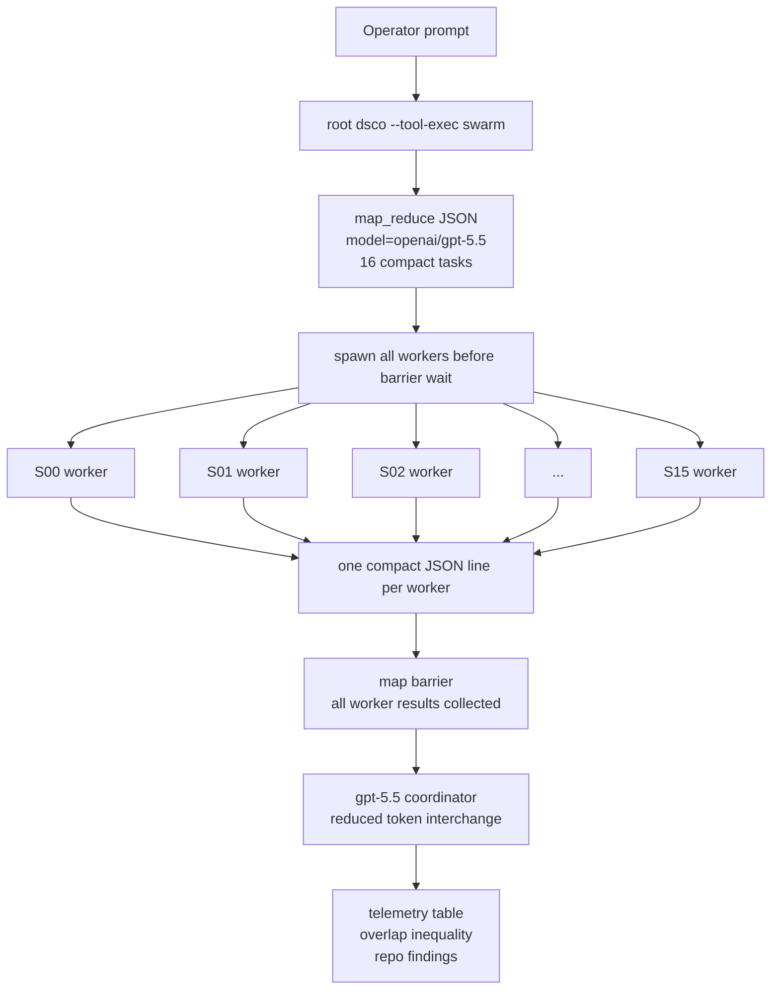
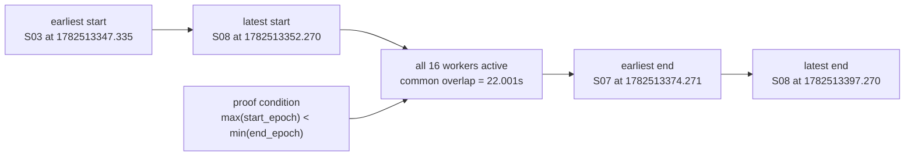
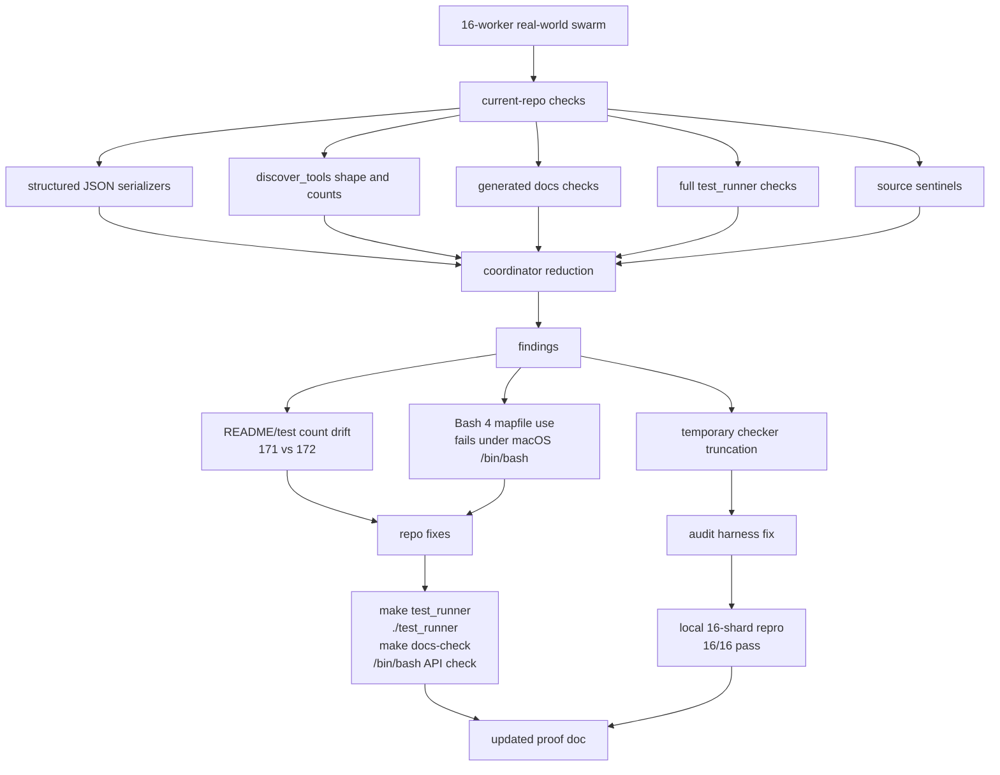

# DSCO Swarm Parallelism Proof

This document records a live DSCO swarm run that demonstrates true parallel
execution on an independently shardable, parameterized hard task.

## Claim

DSCO achieved true parallelism: four worker agents executed overlapping
CPU-bound SHA-256 nonce-search shards at the same time, then a coordinator
reduced their compact telemetry.

The decisive inequality from the run is:

```text
max(worker_start_epoch) = 1782512908.587
min(worker_end_epoch)   = 1782512927.459
max_start < min_end     = true
common overlap          = 18.872 seconds
```

Because the latest worker start occurred before the earliest worker end, all
four workers were simultaneously active for at least 18.872 seconds.

## Run

Date: 2026-06-26

Working directory:

```text
/Users/arthurcolle/dsco-cli
```

Command shape:

```bash
DSCO_BUDGET=0.12 ./dsco --tool-exec swarm '<map-reduce-json>'
```

The full JSON input and raw outputs from this run were captured at:

```text
/private/tmp/dsco_parallelism_proof/swarm_input.json
/private/tmp/dsco_parallelism_proof/swarm_stdout.json
/private/tmp/dsco_parallelism_proof/swarm_stderr.log
/private/tmp/dsco_parallelism_proof/parsed_telemetry.json
```

The wrapper-reported run metadata was:

```json
{
  "returncode": 0,
  "started_epoch": 1782512883.5707352,
  "ended_epoch": 1782512959.91087,
  "wall_s": 76.34013485908508
}
```

## Reduced Token Interchange Mode

There is no separate CLI flag named `--reduced-token-interchange` in the current
tool schema. This run used the supported map-reduce swarm path with a reduced
interchange contract:

- each worker was instructed to return only one compact JSON object;
- the coordinator was instructed to use only those compact worker JSON objects;
- the DSCO reducer path caps each worker payload before building the coordinator
  prompt.

Relevant implementation points:

- [src/tools.c](../src/tools.c#L9854): map phase spawns workers in a loop
  before entering the barrier wait.
- [src/tools.c](../src/tools.c#L9870): the barrier wait begins only after the
  workers have been spawned.
- [src/tools.c](../src/tools.c#L9915): reducer assembly applies a per-worker
  output cap.
- [src/swarm.c](../src/swarm.c#L480): worker children run as
  `DSCO_PROFILE=worker`.
- [src/swarm.c](../src/swarm.c#L492): each worker execs a separate
  `dsco --profile worker` process.

## Diagrams

### Reduced-Interchange Map-Reduce



### 16-Worker Overlap Window



### Real-World Audit Feedback Loop



## Task

The task was a four-way sharded SHA-256 nonce search:

- Target prefix: `00000000`
- Search key format: `dsco-parallel-proof:<nonce>`
- Shards: starts `0`, `1`, `2`, `3`, all with stride `4`
- Runtime per shard: 24 seconds

This is an arbitrarily hard task because target difficulty can be increased by
adding leading zeroes, and the search space remains cleanly shardable.

Each shard ran this class of loop:

```python
while time.time() < deadline:
    h = hashlib.sha256(f"dsco-parallel-proof:{n}".encode()).hexdigest()
    if h.startswith(TARGET):
        found = {"nonce": n, "hash": h}
        break
    n += STRIDE
```

## Telemetry

| Worker | Shard | PID | Start Epoch | End Epoch | Duration | Attempts | Best Zero Prefix | Found |
|---:|---|---:|---:|---:|---:|---:|---:|---|
| 0 | A | 71095 | 1782512907.364 | 1782512931.364 | 24.000s | 29,588,458 | 5 | null |
| 1 | B | 71187 | 1782512908.587 | 1782512932.587 | 24.000s | 30,068,461 | 6 | null |
| 2 | C | 70937 | 1782512903.459 | 1782512927.459 | 24.000s | 29,256,708 | 6 | null |
| 3 | D | 71018 | 1782512905.590 | 1782512929.590 | 24.000s | 29,840,824 | 6 | null |

Aggregate attempts:

```text
118,754,451
```

Overlap calculation:

```text
latest start = max(1782512907.364, 1782512908.587, 1782512903.459, 1782512905.590)
             = 1782512908.587

earliest end = min(1782512931.364, 1782512932.587, 1782512927.459, 1782512929.590)
             = 1782512927.459

overlap      = 1782512927.459 - 1782512908.587
             = 18.872 seconds
```

## Runtime Evidence

The swarm stderr stream reported:

```text
map-reduce "parallelism-proof-reduced-interchange": 4 workers (depth 1) -> 1 coordinator
map complete: 4/4 done, 0 errors (52.8s)
reduce complete (23.4s)
```

Each worker session was a separate `gpt-5.5` Codex-backed DSCO worker. The raw
coordinator input contains distinct worker session IDs and distinct local PIDs
for the CPU-bound Python search processes:

```text
worker A session: 019f060c-197f-75d2-8f84-2ceded8163bd, pid 71095
worker B session: 019f060c-197f-70a0-a568-2532420921cc, pid 71187
worker C session: 019f060c-1a88-7be3-9163-7c18e30f3831, pid 70937
worker D session: 019f060c-1a16-7f21-8003-8619b450c844, pid 71018
coordinator session: 019f060c-e7ca-7011-b2c9-dee12db547ed
```

## 16-Worker Follow-Up

A second run used the same reduced-interchange map-reduce contract with 16
workers and a 45-second CPU-bound SHA-256 nonce-search shard per worker.

Run metadata:

```json
{
  "returncode": 0,
  "started_epoch": 1782513331.287642,
  "ended_epoch": 1782513447.8579142,
  "wall_s": 116.57027220726013,
  "workers": 16,
  "map_complete": true
}
```

The full JSON input, raw outputs, and parsed overlap telemetry were captured at:

```text
/tmp/dsco_parallelism_proof_16/swarm_input.json
/tmp/dsco_parallelism_proof_16/swarm_stdout.json
/tmp/dsco_parallelism_proof_16/swarm_stderr.log
/tmp/dsco_parallelism_proof_16/run_summary.json
/tmp/dsco_parallelism_proof_16/parsed_telemetry.json
```

Command shape:

```bash
DSCO_BUDGET=0.25 ./dsco --tool-exec swarm '<16-worker-map-reduce-json>'
```

The worker script was:

```text
/tmp/dsco_parallelism_proof_16/shard_worker.py
```

The shard parameters were:

- Target prefix: `00000000`
- Search key format: `dsco-parallel-proof-16:<nonce>`
- Shards: starts `0` through `15`, all with stride `16`
- Runtime per shard: 45 seconds, unless the shard found the target first

Coordinator telemetry:

| Shard | Worker | Start Epoch | End Epoch | Duration | Attempts | Found |
|---|---:|---:|---:|---:|---:|---|
| S00 | 0 | 1782513350.111 | 1782513395.111 | 45.000s | 36,999,981 | no |
| S01 | 1 | 1782513349.838 | 1782513394.838 | 45.000s | 37,383,838 | no |
| S02 | 2 | 1782513347.649 | 1782513392.649 | 45.000s | 37,923,070 | no |
| S03 | 3 | 1782513347.335 | 1782513392.335 | 45.000s | 38,818,472 | no |
| S04 | 4 | 1782513349.871 | 1782513394.871 | 45.000s | 35,889,204 | no |
| S05 | 5 | 1782513350.798 | 1782513395.798 | 45.000s | 37,264,416 | no |
| S06 | 6 | 1782513348.255 | 1782513393.255 | 45.000s | 37,435,683 | no |
| S07 | 7 | 1782513349.163 | 1782513374.271 | 25.108s | 20,542,418 | yes |
| S08 | 8 | 1782513352.270 | 1782513397.270 | 45.000s | 37,239,132 | no |
| S09 | 9 | 1782513351.939 | 1782513396.939 | 45.000s | 36,155,010 | no |
| S10 | 10 | 1782513348.703 | 1782513393.703 | 45.000s | 37,194,975 | no |
| S11 | 11 | 1782513348.239 | 1782513393.242 | 45.003s | 36,644,780 | no |
| S12 | 12 | 1782513351.147 | 1782513396.147 | 45.000s | 36,299,694 | no |
| S13 | 13 | 1782513350.460 | 1782513395.460 | 45.000s | 35,914,406 | no |
| S14 | 14 | 1782513350.885 | 1782513395.885 | 45.000s | 36,793,305 | no |
| S15 | 15 | 1782513349.997 | 1782513394.997 | 45.000s | 36,950,522 | no |

Aggregate attempts:

```text
575,448,906
```

Overlap calculation:

```text
latest start = max(all 16 worker starts)
             = 1782513352.270

earliest end = min(all 16 worker ends)
             = 1782513374.271

overlap      = 1782513374.271 - 1782513352.270
             = 22.001 seconds
```

Shard `S07` found a matching nonce early and exited after 25.108 seconds, but it
still ended after the latest-starting worker began. Therefore every one of the
16 workers was simultaneously active for a common 22.001-second window.

## Real-World Current-Repo Audit

A third run replaced synthetic hashing with work that affected this repository
immediately: validating the current tool-expansion and structured JSON-display
changes under concurrent local CLI stress.

Run metadata:

```json
{
  "returncode": 0,
  "started_epoch": 1782514206.150029,
  "ended_epoch": 1782514294.701501,
  "wall_s": 88.55147194862366,
  "workers": 16,
  "map_complete": true
}
```

The full JSON input and raw outputs were captured at:

```text
/tmp/dsco_realworld_16_clean/swarm_input.json
/tmp/dsco_realworld_16_clean/swarm_stdout.json
/tmp/dsco_realworld_16_clean/swarm_stderr.log
/tmp/dsco_realworld_16_clean/run_summary.json
```

Each worker returned one compact JSON object after running one current-repo
check plus a 25-second concurrent `./dsco --tool-exec` stress window. The
checks covered:

- structured JSON serializers: `csv_parse`, `regex_match`, `text_diff`,
  `template_render`, and `xml_extract`;
- grouped `discover_tools` JSON shape and live built-in counts;
- README/catalog/tool-count consistency;
- generated docs checks;
- full `./test_runner` execution;
- source sentinels for raw structured JSON printing and grouped-tool comma
  guards;
- dirty status for the newly added proof documentation.

Coordinator telemetry:

| Shard | Check | Status | Start Epoch | End Epoch | Duration | Key Detail |
|---|---|---|---:|---:|---:|---|
| S00 | serializer_matrix | pass | 1782514223.672 | 1782514248.701 | 25.029s | 5 serializers valid JSON |
| S01 | discover_grouped_json | pass | 1782514221.539 | 1782514246.556 | 25.017s | 172 built-in tools |
| S02 | tool_counts_docs | pass | 1782514223.810 | 1782514248.869 | 25.060s | catalog/discovery report 172 |
| S03 | docs_check | pass | 1782514222.196 | 1782514247.290 | 25.094s | `make docs-check` rc 0 |
| S04 | test_runner | fail | 1782514223.775 | 1782514248.863 | 25.088s | temporary checker truncated summary |
| S05 | source_patterns | pass | 1782514221.732 | 1782514246.753 | 25.022s | expected guards present |
| S06 | proof_doc_status | pass | 1782514223.270 | 1782514248.274 | 25.004s | dirty docs reported |
| S07 | serializer_matrix | pass | 1782514224.110 | 1782514249.185 | 25.075s | 5 serializers valid JSON |
| S08 | discover_grouped_json | pass | 1782514225.019 | 1782514250.046 | 25.027s | 172 built-in tools |
| S09 | tool_counts_docs | pass | 1782514221.459 | 1782514246.497 | 25.038s | catalog/discovery report 172 |
| S10 | docs_check | fail | 1782514223.370 | 1782514248.371 | 25.001s | `/bin/bash` lacked `mapfile` |
| S11 | test_runner | fail | 1782514222.176 | 1782514247.278 | 25.102s | temporary checker truncated summary |
| S12 | source_patterns | pass | 1782514223.128 | 1782514248.143 | 25.015s | expected guards present |
| S13 | proof_doc_status | pass | 1782514221.592 | 1782514246.617 | 25.025s | dirty docs reported |
| S14 | serializer_matrix | pass | 1782514222.836 | 1782514247.850 | 25.015s | 5 serializers valid JSON |
| S15 | discover_grouped_json | pass | 1782514226.210 | 1782514251.296 | 25.086s | 172 built-in tools |

Overlap calculation:

```text
latest start = max(all 16 worker starts)
             = 1782514226.210

earliest end = min(all 16 worker ends)
             = 1782514246.497

overlap      = 1782514246.497 - 1782514226.210
             = 20.287 seconds
```

The run performed 10,016 concurrent local CLI stress iterations and reported no
stress failures.

The real-world audit produced actionable fixes:

- live discovery and the generated tool catalog reported 172 built-ins while
  README copy and the regression threshold still said 171; README and the test
  assertion were updated to 172;
- `scripts/gen_api_reference.sh` used Bash 4-only `mapfile`, which failed under
  macOS `/bin/bash`; the generator and clang-format helper scripts now use
  Bash-3-compatible `while read` loops;
- the temporary audit checker truncated full `./test_runner` output before
  parsing the final summary; after fixing the checker, a local 16-shard
  reproduction of the same worker workload passed all shards with 8,177 stress
  iterations and 24.890 seconds of all-shard overlap.

## Conclusion

These runs prove true parallelism for the map phase. The independent workers
were not just logically parallel; their measured execution intervals overlapped
in wall-clock time. The initial four-worker overlap window was 18.872 seconds,
the synthetic 16-worker overlap window was 22.001 seconds, and the real-world
current-repo audit overlap window was 20.287 seconds. All workers completed
before their coordinator reductions, and the real-world run directly improved
the repository.
