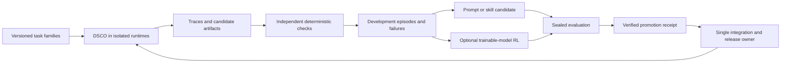

# Prime Intellect learning loop for DSCO

Assessment: 2026-09-12. Recommendation: integrate DSCO as a custom evaluation harness in Prime Intellect's `verifiers`, optimize bounded prompts/skills from independently checked outcomes, then consider weight training with `prime-rl`. This is an integration design, not an installed adapter, measured improvement, or launched training job.

RLM describes a recursive execution architecture; RL describes an optimization method that changes a policy using rewards. A persistent RLM session can accumulate useful state without training model weights. DSCO should record separately whether an improvement changes a skill, prompt, routing policy, executable harness or model checkpoint.

## What to use

| Component | Verified current role | Proposed DSCO use |
| --- | --- | --- |
| `verifiers` | Custom harnesses expose `setup` and `launch`, receive a model interception endpoint and support task artifacts | Run the actual DSCO binary as the solver, preserving C runtime behavior and collecting comparable episodes |
| GEPA in `verifiers` | Uses rollout results and model reflection to optimize `Task.system_prompt`, without gradient training | Optimize a narrowly scoped task strategy prompt; keep governance and authority instructions immutable |
| `IsolatedVerifierEnv` | Transfers declared solver artifacts to a fresh container runtime for deterministic scoring | Build and test candidate patches outside the solver's workspace with protected acceptance tests |
| `prime-agent` | Full RLM agent with persisted refinement mechanisms | Comparative baseline and source of design ideas for durable lessons and recursive delegation |
| `nano-rlm` | Minimal ACP-only RLM runtime with an explicit session contract | Optional controlled recursive-harness comparison; not necessary to evaluate DSCO |
| `prime-rl` | Asynchronous SFT/RL/evaluation stack integrated with `verifiers` | Later train an accessible open-weight policy against the same DSCO task environments |
| Prime CLI/SDK | Environments, evaluations, training, GPU and sandbox management | Optional provisioning and run management once data, budget and runtime boundaries are explicit |

The custom harness API passes endpoint, secret, model context, task data and MCP URLs into `launch`; DSCO therefore needs an adapter that maps these into its real provider/ACP contracts. Advertise MCP or session-resume support only after conformance tests pass. [Pinned harness API](https://github.com/PrimeIntellect-ai/verifiers/blob/a32cc09c58be3bdff3dd5a206afd8d03fb5b9945/docs/v1/harnesses.md).

GEPA produces a candidate system prompt and reuses evaluation configuration. It requires tasksets with `Task.system_prompt`. Its validation split participates in optimization, so it is not the final sealed holdout. Explicitly override rollout and concurrency defaults for the authorized experiment. [Pinned GEPA documentation](https://github.com/PrimeIntellect-ai/verifiers/blob/a32cc09c58be3bdff3dd5a206afd8d03fb5b9945/docs/v1/gepa.md).

Prime's isolated deterministic verifier supports Docker, Prime or another container runtime, and rejects absolute artifact restoration into a host subprocess runtime. Stage private tests in the fresh verifier, never in the solver's accessible tree. [Pinned verification environment](https://github.com/PrimeIntellect-ai/verifiers/blob/a32cc09c58be3bdff3dd5a206afd8d03fb5b9945/docs/v1/env.md).

## Connect the code that already exists

DSCO already has useful components, verified against this checkout:

- `src/event_stream.c`, `src/provider_events.c`, `src/execution_kernel.c`: ordered runtime evidence and provider/tool attempt metadata.
- `src/self_improve.c`, `include/self_improve.h`: turn/session metrics, suggestions and bounded strategy weights. This is not model weight training.
- `src/skill_candidate.c`: a local candidate scaffold and integrity checks; it does not independently establish usefulness.
- `src/autoresearch.c`: a bounded proposal/evaluator loop that retains a target when a numeric score improves. Its single mutable target and evaluator score are insufficient as a general multi-agent promotion authority.
- `src/rsi_curriculum.c`: promotion criteria. Values such as provenance/signature checks are currently supplied as summary fields; a coordinator must derive them from verified receipts rather than trust an agent's booleans.
- `src/blackboard.c`: frozen task contracts, generation fencing and artifact acceptance, suitable for retaining candidates and evidence.

Keep Python evaluation/training dependencies in a separate package, proposed `evals/prime_dsco/`. Keep the shipped CLI in C. Proposed `DscoHarness` should launch the exact pinned binary in a fresh runtime, inject only the authorized model endpoint/credentials, collect artifacts and account for its descendants. Do not implement a mock DSCO agent in Python and call its score DSCO performance.

Linux container runs cover portable CLI behavior. Native macOS/Kitty behavior still needs local owned-PTY and platform checks; a Linux training score cannot certify those features. Pin source snapshot, binary hash, compiler, image, harness config and provider/model revision for every episode.

## The feedback cycle

The 60 prompts become a **development task backlog**. A prompt alone is not a reproducible RL environment. Each selected task needs an immutable starting snapshot, bounded runtime, expected artifacts and externally held acceptance tests. Preserve accepted and rejected attempts, timeout classifications and negative examples; do not train only on an agent's self-reported wins. Once an implementation changes the codebase, retain the original task snapshot so later policies solve the same problem instead of receiving the completed feature.

After each accepted delivery, extract a concise candidate lesson with supporting episode IDs, applicability conditions, counterexamples and expiry/version rules. Evaluate it on separate tasks before making it a default. Treat extracted instructions as untrusted content until reviewed; repository text and tool results cannot teach away capability denials. Track which lesson version each future task consumed so regressions can be attributed and rolled back.

## Evaluation before optimization

The initial claim is: a candidate DSCO strategy improves independently verified task completion under the same model and resource budget. The unit of analysis is a task family, with repeated episodes nested within it. Compare baseline and candidate on the same starting bytes, task, tool availability, model revision, sampling policy and deadline. Record randomness even when a provider cannot guarantee seeded determinism.

Use development, calibration and final holdout families. Group related patches, fault variants and source snapshots together before splitting to prevent near-duplicate leakage. The 60 visible implementation prompts are development material; build new sealed task families for final claims. Never tune GEPA, rewards or the judge on that final set. Run a small adapter smoke first; select the efficacy sample count and practical effect threshold before the expensive comparison. A small or wide-interval result is inconclusive, not promotion evidence.

Cover at least these strata: terminal responsiveness, MCP lifecycle, provider failures, context continuity, durable worker recovery and capability enforcement. Record verified success, infrastructure failures, missing/unfinished episodes, TTFT, total latency, all-agent tokens, retries, peak memory, dollar cost where priced and cost per accepted outcome. Missing prices remain unknown. Do not silently drop failed attempts when calculating reliability.

Use task-family paired bootstrap intervals or a predeclared randomization test, and report sample count and effect size. Require a positive lower confidence bound plus the chosen practical improvement threshold, with no observed capability regression and no material cost/latency regression beyond the predeclared tolerance. Zero observed safety failures is a tested result, not proof of impossibility. If many candidates are compared, use a fixed selection budget and a fresh sealed evaluation for the selected candidate.

## Reward and verifier ownership

Do not reward tool-call volume, token volume, wall time spent, self-assessment, or an editable test file. The verifier owns tests, scoring code and grading inputs. Build success alone is not feature completion. An accepted feature requires the observable acceptance behavior and applicable regression checks.

A proposed initial reward is hierarchical:

1. Unauthorized effects, test tampering or missing required provenance invalidate the candidate.
2. Ordinary failure earns zero; declared infrastructure failures are separately classified and counted in end-to-end reliability.
3. Verified success earns one, with small bounded penalties for cost and latency within the allowed envelope. Penalties cannot make a correct authorized solution rank below a broken one.

Predeclare penalty scales from baseline measurements. Retain component metrics rather than only the scalar reward. Learned policy may choose better tools, decomposition, retrieval and budgets; it may not change authority, hidden tests or the promotion decision. The existing delivery design's trusted receipts must bind task, generation, contract, artifact, dependencies, checker and binary hashes.

## Weight training is a later, separate stage

Use hosted frontier models for evaluation or candidate generation if authorized; their inference access does not provide their trainable weights. For actual RL, choose a model whose weights and training license are accessible, and route fresh policy rollouts through the configured training inference service. Trace logs alone are not an on-policy RL dataset. The adapter must preserve model version, messages, exact rendered/tokenized trajectories, action masks and the probability information required by the pinned trainer; tool results are observations, not sampled policy tokens.

`prime-rl` supports SFT, RL and evaluations with `verifiers`, and its self-hosted setup requires NVIDIA GPU compute. DSCO's local macOS runtime remains the product/test endpoint; training runs on separately provisioned compatible infrastructure. Specify the checkpoint, compatible inference server, resource ceiling and stop rules before allocating GPUs. [Pinned training framework](https://github.com/PrimeIntellect-ai/prime-rl/blob/28bb83bea7e9dfd92a331a02c846298c53271dec/README.md).

Prompt/skill learning can improve behavior without new model weights, but still consumes evaluation/reflection inference. Begin with narrow decisions such as recovery strategy or tool selection; do not start with unrestricted self-modification of the whole runtime.

## Concrete implementation order

1. **DSCO harness adapter:** one provider-free controlled endpoint smoke proves interception, exact prompt injection, cancellation, descendant cleanup and artifact collection. Add a bounded live evaluation only under the selected provider budget.
2. **Replayable taskset:** package representative failures and feature tasks with immutable starting snapshots and a fresh deterministic verifier. Verify an intentionally broken candidate fails and a repaired one passes.
3. **Episode export:** join delivery candidates, verifier receipts and runtime traces into versioned records; redact secrets and separate private source artifacts from shareable metadata. Keep uploads off initially.
4. **GEPA pilot:** optimize one task strategy prompt on development/calibration splits while freezing governance and base model. Independently test the selected candidate on sealed tasks.
5. **Lesson promotion:** add the validated skill/prompt to the single-owner integration queue; canary its effect and retain the previous version for rollback.
6. **RL pilot:** after the environment and reward are reliable, train one accessible small policy and compare it against the untrained policy with identical tasks, tools and limits.

Current evaluation defaults upload results; use the documented `--no-push` option for local work. Do not export proprietary task bytes or allocate compute merely by following a default configuration. [Pinned evaluation options](https://github.com/PrimeIntellect-ai/verifiers/blob/a32cc09c58be3bdff3dd5a206afd8d03fb5b9945/docs/v1/evaluation.md). Prime's CLI provides run and compute management when those actions are authorized. [Prime CLI](https://github.com/PrimeIntellect-ai/prime/blob/d761403915abee6c834fc5a015c47ff056369119/README.md).

## Pin the upstream contracts

These public revisions were resolved during this inspection; revalidate compatibility before implementation:

| Repository | Revision |
| --- | --- |
| prime-agent | `878410b3981f20c6d685faa210ad0e43426cf483` |
| nano-rlm | `3045e4cd965d990ecb78023fd9e5546a535211cf` |
| verifiers | `a32cc09c58be3bdff3dd5a206afd8d03fb5b9945` |
| prime-rl | `28bb83bea7e9dfd92a331a02c846298c53271dec` |
| prime | `d761403915abee6c834fc5a015c47ff056369119` |

Prime Agent's refinement persists prompts/memories/skill descriptions; that behavior is distinct from the model-training framework. Its Python execution runs with the user's permissions, so it cannot be adopted as a DSCO capability boundary. [Pinned Prime Agent overview](https://github.com/PrimeIntellect-ai/prime-agent/blob/878410b3981f20c6d685faa210ad0e43426cf483/README.md).

Nano-RLM currently launches through ACP with an explicit `ai.prime.rlm/runtime-v1` contract and final session metrics. Its in-memory Python state survives compaction, but not arbitrary process termination. Prime Agent and Nano-RLM have different recursion APIs; do not substitute one contract for the other. [Pinned Nano-RLM contract](https://github.com/PrimeIntellect-ai/nano-rlm/blob/3045e4cd965d990ecb78023fd9e5546a535211cf/README.md).
