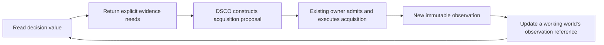

# Lingo design explorations: values, decisions and executable work

September 10, 2026. **Ideation following the implemented 0.2 foundation.** This
document proposes language and operator behavior; it does not expand the executable
API contract. The one [decision study](../../examples/lingo/decision-study.lingo)
identified as running below uses only existing 0.2 APIs. No runtime or installed
binary was changed for this exploration.

The central idea: **a Lingo value should be something a person can open, question,
compare, share with an agent, and use to propose work.** Its address identifies the
question. Its context identifies the knowledge and definitions used to answer it.
Its explanation exposes the actual calculation. Its resulting proposal identifies
the work to perform, if someone chooses to perform it.

## 1. Make decisions richer than booleans

The current platform's `Task.eligible` and `Task.readiness` are useful first
calculations. A richer Decision should answer four different questions:

1. Is there enough evidence to decide?
2. Which alternatives satisfy the hard requirements?
3. Which admissible alternative best matches the preferences?
4. What evidence and assumptions support that selection?

Those questions deserve a common result contract:

| Outcome | Meaning | Appropriate next action |
|---|---|---|
| `ready` | An answer exists under the declared evidence and comparison scope | Inspect or use it to construct a proposal |
| `needs_evidence` | A required observation is absent, expired or incomplete | Consider explicit acquisition of the named evidence |
| `refused` | Known alternatives fail the hard requirements | Change requirements, add alternatives or stop |
| `error` | Evaluation or its contract failed | Diagnose the implementation or invalid input |

An explicitly unknown price is not zero. An empty but complete candidate set is
different from a failed query. A known infeasible route is different from a route
that cannot yet be evaluated. A low-quality answer is not necessarily an execution
error: quality acceptance belongs to the domain contract.

Prefer explicit result matching over a truthy `Unknown` sentinel. Lua treats
userdata and tables as true, so `if quote then ...` would otherwise admit an
unknown quote. The proposed library should make extraction deliberate and retain
the distinction between a successful `false` value and an unavailable value.

A Decision could retain:

```text
Decision {
  outcome,
  context_id,
  selected_alternative?,
  comparison_scope,
  admissible_alternatives,
  rejection_ledger,
  ranking_policy,
  evidence_addresses,
  evidence_needs
}
```

These are domain records with shared semantics. They need not be new Lua keywords.
The existing core already calculates JSON records and tracks their input reads.
An eventual tagged-union type can enforce the mutually exclusive result shapes.

### A runnable study

The [decision study](../../examples/lingo/decision-study.lingo) defines a small
fictional offer book and computes a decision entirely through current Lingo values.
It uses synthetic integer cost units, illustrative quality scores and an explicit
`as_of` time. It is not a model benchmark or a quote from any provider.

```sh
dsco lingo run examples/lingo/decision-study.lingo
```

Run from the `dsco-cli` checkout. [The retained result](../../reports/lingo-ideation-20260910/decision-study.json)
was produced by the installed 0.2 binary with network and write capabilities denied.

| Scenario | Decision | Reason |
|---|---|---|
| Baseline: economy preference, 3,000 ms deadline | `balanced` | Cheapest admissible offer |
| Prefer quality | `fast` | Highest quality among admissible offers |
| Relax deadline to 5,000 ms | `economy` | Previously excluded cheaper offer becomes admissible |
| Keep deadline but reduce budget | `refused` | No known offer satisfies both constraints |
| Advance explicit evaluation time past evidence expiry | `needs_evidence` | A current comparison needs a new catalog observation |

The program makes **zero tool calls**. Each result contains the candidate ledger,
and each scenario restores the baseline. Three stale offers share one evidence
source, so the study reports one acquisition need. It does not execute that need.

The study deliberately refuses to declare a winner when an unobserved candidate
could change the result. A later optimizer could decide with incomplete evidence
only when explicit bounds establish dominance, or when the result clearly says
“best among this evaluated subset.” It must not quietly claim exhaustive selection.

## 2. Let missing evidence become a calculable worklist

Suppose fifty tasks need the same updated model catalog. They should be able to
refer to one shared need, consume one admitted acquisition result, and calculate
again. This gives agents a useful common coordination object.

The sequence is:



An evidence need should include a source/operation, typed request, relevant scope,
required coverage and freshness condition. It should not contain live credentials.
Its deduplication identity must include tenant/visibility constraints and compatible
freshness requirements. Matching a URL or payload digest alone does not establish
that two principals may share a result.

A need is not a command, and reading a value never spends money. DSCO may show the
estimated acquisition cost, choose among permitted acquisition strategies and
submit an explicit proposal through the existing tool gate and backend owner.
Re-reading an unresolved value must not launch another job on every read.

The changing world reference is the tracked dependency. The original Observation
remains immutable; historical contexts continue to use it. Two acquisitions that
return identical bytes can share content storage while retaining distinct event
identities and capture times.

This is a concrete extension of the blackboard idea in the earlier article: agents
coordinate around identified missing inputs and observed completions. Shared claims,
leases and dispatch still belong to a durable execution owner. A graph record saying
“in progress” cannot by itself prevent duplicate external work.

**Useful first binding:** one exact Autobot discovery/catalog acquisition shared by
several Decision values. Keep one request shape, explicit refresh, and the existing
execution identity before generalizing to arbitrary goals or reactive agents.

## 3. Give every answer an evaluation context

The existing ValueAddress binds world/object/class/field/arguments to a definition
and runtime. It deliberately follows the selected world's stored inputs and current
scenario. A durable answer needs to record which context was used as well.

Proposed concepts:

| Concept | What it fixes |
|---|---|
| Logical selector | The object and field being requested; it is not a reproducibility pin |
| Bound ValueAddress | The exact definition and typed arguments giving that request meaning |
| EvaluationContext | Stored data, source lock, explicit overlays, observations and visibility scope |
| Evaluation | Context plus bound address, outcome, actual read dependencies and attempt metadata |

The current bound address remains strict. Evaluating under new source requires an
explicit new binding of the logical selector; it must not ignore the old address's
definition hash.

Illustrative **proposed syntax**, not callable today:

```lua
local context = world:seal()
local answer = context:evaluate(address)
local alternative = context:with {
  {object="policy:review", field="deadline_ms", value=5000},
}
local comparison = answer:compare(alternative:evaluate(address))
```

An immutable context could initially reconstruct a small private world using the
current two-pass load mechanism, with its own cache. Save scenario overrides as
explicit address/value records relative to a pinned base. A scenario recipe is
reapplied through scenario semantics; its values are not silently converted into
persisted base facts. Structural sharing can follow after correctness.

**Important counterexample:** `local multiplier=args.multiplier` captured by a
derived closure is not frozen by hashing its source and storing the world. Copying
the declaration table also copies those captures. A captured old world/reference
can point outside the new context. Sealing can promise pinned stored data first;
replayable calculations additionally need admitted definition packages whose
changing inputs enter through fields or explicit arguments. The language should
distinguish these guarantees rather than claim that a hash proves purity.

A sealed collection of independently timed observations remains exactly that.
It is not a simultaneous snapshot of all remote services. Backend revision pins
can strengthen the context when a verified binding supplies them.

## 4. Make routing a book of inspectable alternatives

The current `lingo.chimera` already supplies per-request preferences and obtains an
actual Router decision. Lingo should make that decision a navigable object with
admissibility, rankings, evidence freshness and expected execution effects.

Keep three layers visible:

1. **Requirements:** modalities, context capacity, budget, deadline, provider or
   region restrictions, output contract and known-price requirements.
2. **Preferences:** how to rank alternatives after requirements are satisfied.
3. **Admission:** current account capability, credits, credentials and execution
   capacity checked by the actual execution owner.

A quality preference cannot compensate for a violated hard deadline. An inexpensive
route with an unknown price is not known to fit the budget. A locally eligible task
does not reserve funds or capacity: two concurrent tasks can both appear affordable
against the same snapshot. Reservation and actual dispatch remain backend operations.

The interesting operator interaction is **“why this route rather than that one?”**
It should show the rejected alternative's precise constraint or the ranking terms
that favored the winner. Units, score normalization and tie-breaking must be part
of the policy definition, especially when mixing quality, cost and latency.

The study's local arithmetic illustrates this interaction; it is not a replacement
implementation of Chimera's scoring. Native route decisions should preserve the
Router's actual decision, admissibility scope and selected execution identity.
Counterfactual comparisons based on a captured catalog are labeled offline. A new
native routing request is an explicit interaction that produces a new Observation.

Longer term, a book of tasks could calculate total estimated spend, work blocked on
evidence, alternative allocations and sensitivity to a deadline or price. Aggregate
budgets must account for shared prerequisites, retries, reservations and alternative
branches. Adding per-task worst cases can be conservative; adding expected costs
does not by itself establish an execution guarantee.

## 5. Let values describe work before work is performed

An object should be able to calculate a proposal in the same way it calculates a
cost. Examples include a build's test plan, an experiment's measurement plan, a
report's evidence collection, or an organization's next required filing.

The proposed `Intent` represents a frozen invocation:

```text
Intent {
  logical_effect_id,
  parent_task,
  execution_owner,
  exact_target_and_contract,
  bound_arguments,
  decision_context,
  preconditions,
  budget_request,
  acceptance_contract,
  source_identity
}
```

A pure value can propose those fields. Admission and dispatch are explicit actions.
The operator displays the exact intended target and arguments alongside the
calculation that produced them. Selecting Act operates on that frozen proposal;
it cannot silently recalculate a different action against newer inputs.

If a prerequisite changes, produce a stale-proposal result and a new proposal
version. The actual backend still validates live conditions at admission. A language
precondition cannot manufacture atomicity with a remote target that supplies no
conditional operation.

Give the **logical effect** and each **attempt** different identities. Retries of
the same admitted intent may reuse an owner-supported idempotency key. Two separately
authorized, identical-looking actions need different logical effect IDs. Hashing the
arguments alone would incorrectly collapse those actions.

Autobot composition already has representations for typed steps, input mappings,
execution state and lineage. It is a useful first lowering target. The same Intent
contract can later bind to fleet or OTP without moving their scheduling and recovery
logic into the value evaluator.

### Close the loop with acceptance

Receipt ingestion should associate an immutable observation with the original
Intent and Run. Domain values can then ask whether the expected output exists,
whether its schema and content checks pass, and whether the acceptance contract is
satisfied. Store execution success and accepted result separately.

For example, a test command can exit successfully but fail to produce the promised
report. Conversely, a transport timeout can follow a successful remote action.
That is an unresolved execution outcome, not permission to run it again. Reconcile
through the selected owner's identity and retain both the attempt and subsequent
evidence. A new receipt should take the user back to the same task and proposal.

## 6. Make a value portable between interfaces

A notebook cell, a CLI result, an agent message and a DSCO inspector should share a
small selection record:

```text
Selection {
  value_address,
  world_artifact_or_context,
  optional_saved_scenario,
  presentation
}
```

Presentation might say table, scalar, graph or comparison. It does not implement
the formula. Pasting the selection into DSCO resolves the same context and uses the
same native `read/explain` methods. Copying only an address is appropriate for a
following view; reproducing a historical result requires the context/artifact pin.

Several operator affordances follow:

- **Follow why:** move from an answer to the actual fields and code it read.
- **Change this assumption:** open a scenario control on the selected stored value.
- **Compare:** show changed answers and differences in actual read sets.
- **Show affected values:** inspect known downstream consumers, with coverage stated.
- **Propose work:** freeze an Intent calculated under a selected context.
- **Open the receipt:** return from execution evidence to its originating proposal.

A dependency trace records program reads; it is not a complete causal explanation.
A changed branch may reveal inputs absent from the baseline trace. Likewise, known
downstream consumers cover values evaluated so far, not every possible future
parameterization. Operator labels should describe those limits accurately.

The surface can stay small. A table whose cells are ValueAddresses, an expression
buffer, a dependency inspector and a scenario comparison already provide a coherent
workbench. Web/native/chat interfaces can consume that same service progressively.

## 7. Separate changed knowledge from changed definitions

Reusable definition packages are the next source abstraction. Embedded
`lingo.platform` demonstrates the desired behavior: multiple entry scripts use the
same class definitions. A custom package should carry textual modules, exact imports,
named exports, class identities and a runtime compatibility requirement.

Acquiring source is an explicit admitted action. Importing an already admitted
package resolves a fixed source lock and declares definitions without service calls.
A world artifact must never cause an implicit download and execution of whatever
source its metadata names.

Keep two upgrade operations separate:

- **Re-evaluate:** deliberately bind compatible stored inputs to new definitions.
- **Migrate:** run an explicit transformation that creates new stored inputs.

An unchanged primitive field type does not prove compatibility. A `number` changing
from basis points to a decimal fraction has changed meaning. Units, rounding rules,
missing-value treatment and result contracts belong in the compatibility analysis.
Historical `load` remains strict; never patch an old artifact's hashes to admit it.

The compelling operator view is a four-way comparison:

| | Old source | New source |
|---|---|---|
| Old data | Historical result | Effect of changing the implementation on old inputs |
| New data | Effect of changing inputs under the old implementation | Proposed current result |

The fourth result can include interactions between both changes. Do not pretend
that the two individual differences necessarily sum to the combined difference.
Such comparisons separate a changed price observation from a changed cost formula,
or a changed test fixture from a changed acceptance rule.

The first package loader can support one explicitly supplied bounded package with
exact imports. Large dependency resolution, dynamic loading and source deployment
are later problems. Retain old/new source locks, data artifacts, mapping or migration
identity and comparison evidence in an upgrade record.

## 8. Make queries honest about membership and coverage

“All tasks waiting for evidence” is itself a value. The current `w:objects(class)`
already tracks catalog membership, and ordinary field reads capture predicate
dependencies. A first query implementation can use a bounded full local scan.

The difficult case is often an empty result. If dependencies include only returned
rows, creating the first matching object never invalidates that empty answer. A
previously excluded object becoming eligible must also invalidate the predicate.
Queries therefore depend on examined membership, predicate fields and ordering
fields, with deterministic tie-breaking and explicit pagination bounds.

Remote observation sets need additional metadata: exact request, acquisition
identity, source scope, optional revision pin, returned rows, and completeness
(`complete`, `partial` or `unknown`). Two offset pages fetched during concurrent
writes are not necessarily a consistent collection. An empty page is not proof
that the whole source is empty.

Freshness and completeness are different. An older complete snapshot may support
an exhaustive historical decision; a recent partial scan cannot answer the same
question. Start with explicit refresh and coarse observation-set dependencies.
Bind incremental indexes and subscriptions only after the selected backend path
proves the required revision and invalidation behavior.

## 9. The first operator journey worth building

An operator opens a pinned book of regression tasks. One task cannot choose a
route because its pricing observation has expired. The value names the required
catalog refresh. DSCO shows the acquisition proposal and submits it once through
the existing owner. Several dependent tasks use the new immutable observation.

The operator compares economy and quality policies, follows the rejected candidates,
and chooses a scenario. The selected changes are explicitly promoted into a new
base version. DSCO freezes a task Intent with the exact route/tool contract and
acceptance checks. The backend admits it, executes it and returns a receipt.

An agent opens the same task selection from that receipt and verifies the produced
artifact. The operator can still reopen the original context to see what was known
before the refresh and why the original decision was blocked.

That journey exercises the language, world and operator together. It has a clear
terminal result: the accepted artifact is linked to its intent, decision, source,
data and evidence. It also exposes recovery problems early rather than hiding them
behind a large new orchestration language.

## 10. Development choices

| Direction | Why it is attractive | What to establish first |
|---|---|---|
| Decision and evidence-need records | Makes uncertainty and alternatives useful immediately | Common outcome shape; explicit comparison scope; no automatic acquisition |
| Pinned selections and retained scenarios | Lets people and agents share the same calculation | Context identity, source binding and replayability limits |
| Admitted definition packages | Reuses domain behavior across scripts and services | Exact imports, pure declaration phase, explicit upgrade contracts |
| Intent plus receipt/acceptance projection | Connects calculated decisions to accountable execution | One existing backend owner; stable logical effect/attempt identities |
| Shared needs and observation sets | Reuses evidence across many tasks | Scope-aware identity, completeness and durable acquisition ownership |
| Incremental queries and following views | Keeps the operator responsive as the world changes | Correct membership dependencies and verified change streams |

I would build a **Decision worksheet with a pinned selection** first, then a small
definition package and one faithful Intent binding into Autobot. Shared acquisition
and query subscriptions can grow from that working loop. Lua syntax remains the
expression language; new semantics live in a small set of explicit library and host
contracts. Native kernels and distribution can be added without changing the
meaning of the question an object is being asked.

## Grounding

This exploration builds on the [current core](../LINGO.md),
[platform declarations](../LINGO_PLATFORM.md), [stored-world contract](WORLDS.md),
[service bindings](SYSTEMS.md), and the
[SecDB mechanism reconstruction](../../../reports/ecosystem-exploration-20260910/notes-evidence.md).
The [execution audit](../../../reports/ecosystem-exploration-20260910/execution.md)
identifies existing lifecycle owners; the
[state audit](../../../reports/ecosystem-exploration-20260910/state-and-language.md)
distinguishes GraphSub implementations from guarantees exposed by individual routes.
