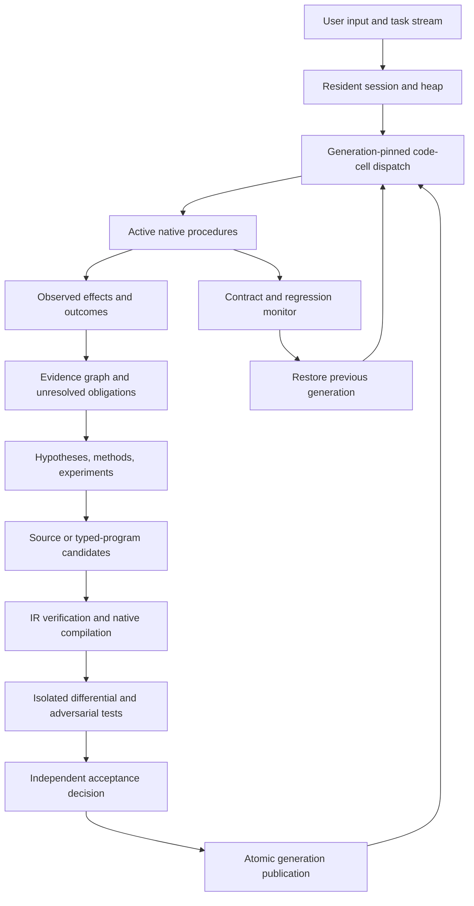

# A resident binary that reasons about and rewrites its executable behavior

This replaces the earlier generic feature roadmap. The target is a living DSCO runtime whose own observations produce code candidates, whose candidates are tested against independent expectations, and whose active native procedures can change without replacing the process image. Prompts 01–60 specify the foundations; prompts 61–120 add trained specialist RLMs and their learning infrastructure. These are implementation tasks, not claims that the system is already built.

Each operational role now owns a trainable Recursive Language Model with an external context environment, programmatic recursive calls, independent scoring and a versioned checkpoint or adapter. [The role training design](ROLE_RLM_TRAINING.md) defines the data and weight-update loop separately from native code activation.

## The decisive behavior

A running agent observes that its retrieval ranking repeatedly prefers duplicated, unsupported material over a short primary source. It identifies a falsifiable failure hypothesis, inspects the active ranker's code and contract, constructs a replacement, and compiles that replacement into a new executable generation. The candidate beats the current implementation on frozen examples and separate unseen cases. The runtime publishes the new entrypoint at a safe point while retaining its conversation, evidence graph, live heap and active requests. Old calls finish on the old generation. A later candidate fails a counterexample and is rejected; a separately admitted candidate that violates a monitored contract triggers a return to the previous generation.

That is the first end-to-end milestone. Editing a prompt, changing a scalar strategy weight, saving a `.c` file, or running `/restart` does not establish native self-rewriting. Those can contribute candidates, but the native acceptance test must observe new executed instructions. PID continuity is also insufficient because `exec` can retain the PID while replacing the address space.

## Three representations, one explicit identity chain

| Representation | What changes | Evidence required |
| --- | --- | --- |
| Reasoning program | Typed operations, dependencies, inference requests and evidence requirements | IR generation/hash, validated graph, actual stage input/output lineage |
| Executable code cell | Machine instructions implementing an admitted procedure | Native code hash, ABI, entrypoint generation, disassembly/source map, observed calls |
| Learned policy | Which program, experiment, rewrite or model to select | Versioned policy and independent outcome improvement under matched resources |

Track the transformation from source proposal through typed IR, compiler identity, executable bytes, verification receipt and active dispatch generation. Never label an interpreter update or a dynamic-library load as diskless JIT generation. Both are useful backends, but their acceptance evidence differs.

An initial native code cell can be a bounded pure integer scorer with a fixed record input and scalar output. The machine-code backend admits a deliberately small instruction/operation set, validates every input access, forbids arbitrary imports and defines overflow behavior. That is enough to demonstrate real in-memory instruction generation and behavioral improvement without pretending a complete C compiler can safely rewrite arbitrary process state.

The C-to-module backend can support broader procedures through the existing platform loader, but it must record its disk artifact and loading step. Native code is ultimately executed with the process's authority; a function-pointer table or a passing test suite is not an isolation boundary.

## Runtime structure

The input loop and ongoing task execution do not wait for investigation, compilation or evaluation. These are scheduled background work with explicit deadlines and cancellation. An interrupted investigation keeps validated observations and marks incomplete stages; it does not fabricate a completed reflection.

## Executable code cells

The proposed cell descriptor includes `cell_id`, source/IR/native hashes, target ISA, ABI version, input/output schema versions, state schema, declared effects, supported host calls, generation, predecessor, limits and the verification receipt. The active dispatch map is published as an immutable generation object. Calls acquire a generation lease before resolving an entrypoint; the lease survives nested calls and callbacks that might still reference that code.

A multi-cell candidate publishes one compatible dispatch map, not several unrelated pointer writes. The publisher compares the expected parent generation with the actual active generation. A stale candidate is reevaluated against its new dependencies rather than overwriting a later improvement. Retired code and its constants remain alive until all references and frames are gone. A successful pointer swap does not authorize unloading code still on another thread's stack.

Publication also binds the acceptance revision and evidence epoch. Serialize the final validity check and dispatch publication with acceptance invalidation; comparing the parent code generation alone cannot detect a revoked receipt. Invalidation of an active generation blocks new admissions and redirects future calls to a still-valid compatible champion, or pauses that cell if none exists. Existing frames retain their lifetime leases. Test invalidation both immediately before publication and during probation.

State migration operates on explicit owned records or handles, never guessed raw pointers. Validate a migrated copy before publishing its generation. Define what happens to old readers, mutable writes, long-running operations and rollback when the state schema changes. Some migrations require a bounded quiescent interval; others cannot be rolled back without a reverse migration. A failed migration must leave the previous active state usable.

Start with stateless or immutable cells. For the first mutable migration, fence new writers, drain existing writers, and retain that fence from snapshot through validation and atomic publication. A delayed old-generation writer must be rejected or resubmitted against the new schema; it cannot commit after the migrated snapshot. Rollback after new-generation writes requires a verified reverse migration of current state or an explicit lossless reconciliation protocol. Retaining the old snapshot alone would discard those writes and is insufficient.

The evaluator, publication protocol and authority contract stay outside an individual candidate's mutation scope. This is an experiment boundary, not a filename lock: repository source edits still follow ordinary capability policy. Revising the evaluator itself is a separate versioned change evaluated independently. A candidate cannot improve its score by rewriting the test or disabling a denial.

## What the supplied Python code contributes

The useful transfer is executable structure, not the promise implied by class names:

- `UniversalMultiHopRAG` suggests query → evidence → notes → next query. Convert strings into evidence-addressed obligations, preserve contradictions and stop on resolved questions rather than a fixed hop count.
- `CognitiveArchitecture` suggests a resident perception/planning/execution/reflection loop. Wire typed results between stages and let reflection change the next action; dependency ordering alone does not carry information.
- `DeepReasoningProgram` supplies explicit methods and critique. Make probabilistic calculations complete and deterministic where possible; make accepted criticism invalidate or revise downstream code proposals.
- `MetaToolRegistry` supplies inspectable source, AST transformations and executable composition. Transfer this into verified code-cell candidates with lifetimes, effects and a measured oracle.
- `FourModelHierarchicalSwarm` and `ScaledSwarm` supply decomposition and candidate populations. Select them using validated outcomes and error complementarity; text-prefix agreement and answer length are not correctness evidence.
- DSPy optimizer wrappers supply search over candidate programs. Preserve their optimization role while replacing substring/nonnull scoring with task-specific checks and held-out evaluation.

The [source audit](SOURCE_AUDIT.md) identifies exact observed limitations that the prompts address. Donor files remain untouched.

## What the C runtime already provides

`src/vm.c` has code storage, registers, a stack and callback dispatch. It is a starting point for an interpreter backend, not an existing typed self-modifying runtime. Its raw callback invocation must not become a path for generated tool calls to evade `tools_execute_for_tier()`.

`src/plugin.c` loads native libraries and resolves exported symbols. It provides a loader starting point, not concurrent generation ownership, ABI migration, candidate verification or automatic improvement. `src/agent.c` currently implements `/restart` using `execvp`; preserve that separate operational feature without counting it as live mutation.

`src/ast.c` provides source summaries and dependency queries, not a complete semantics-preserving C compiler. `src/prompt_program.c` compiles bounded prompt programs but does not generate machine code. `src/blackboard.c`, `src/execution_kernel.c`, `src/event_stream.c`, `src/cost_frontier.c` and `src/self_improve.c` provide portions of ownership, evidence, selection and observation. New modules should extend these contracts instead of appending an entire new runtime to `tools.c` or `agent.c`.

## The first native proof

1. Start one owned DSCO test process. Allocate a random resident sentinel, retain an open session handle and begin calls against ranker generation A.
2. Supply observations where A returns a demonstrably wrong document ranking. Use an inference-backed proposer for the eventual autonomy claim; a deterministic candidate fixture proves only the mechanical mutation path.
3. Produce B with a different control-flow/dataflow program, not merely a changed configuration value. Retain source/IR hashes and generated instruction bytes.
4. Evaluate A and B on identical cases plus hidden generated combinations. Include duplicates, absent evidence, contradictory reports, integer limits and inputs outside admitted bounds. Freeze expected ranking rules outside candidate control.
5. Admit B, publish its entrypoint, and observe new calls running B while a deliberately suspended A call completes. Confirm sentinel address/content, handle continuity and uninterrupted session counters. Trace/reject `exec` during the test, and use a fresh instruction hash to prove native code changed.
6. Submit C that improves one visible case but fails an unseen one. It must never become active. Separately inject a monitored failure into an admitted, bounded candidate and demonstrate pointer/state rollback while the process remains viable.
7. Report baseline/candidate task success and all compilation, inference, testing and latency costs. A faster wrong ranking is not improvement. A process crash or corrupted shared heap is not something a pointer rollback can reliably repair; broader arbitrary native code requires an external supervisor and stronger execution boundaries.

On Apple silicon, executable memory admission and JIT write protection are platform contracts. Probe the actual executable's capabilities and use the documented allocation/write-protection path; an unsupported configuration must report that limitation instead of silently falling back and claiming diskless JIT. Do not disable system-wide protections. [Apple's JIT porting guidance](https://developer.apple.com/documentation/apple-silicon/porting-just-in-time-compilers-to-apple-silicon).

## Improvement that can accumulate

Retain task families, observed failures, minimized counterexamples, accepted rewrite rules, code generations and their outcome records. Repeated corrections become parameterized executable procedures with explicit applicability conditions. The system learns when to use a procedure and when to abstain, investigate or invoke a more capable model. Preserve old counterexamples and separate unseen families so each improvement is checked for regressions and transfer.

Prime Intellect/DSPy can optimize the proposer, reasoning program or trainable policy around this native runtime. They do not supply proof that generated machine code is safe or that a particular behavioral change is better. Keep model weight updates, prompt optimization and native generation changes separately versioned and evaluated. The first milestone does not require weight training or paid GPU allocation.
