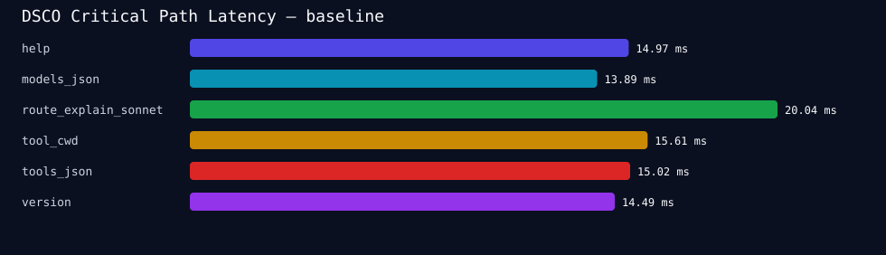
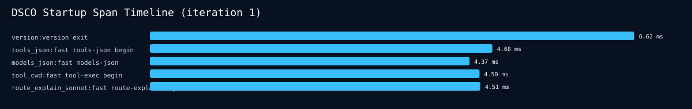
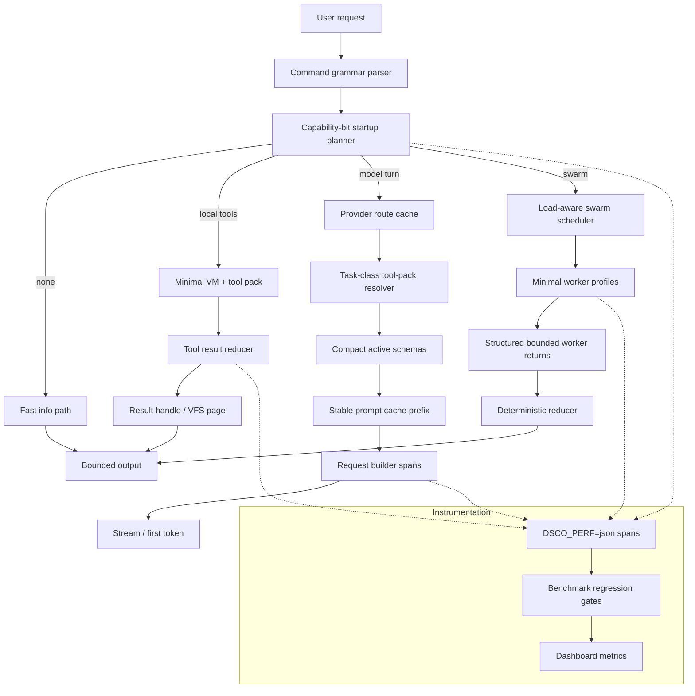
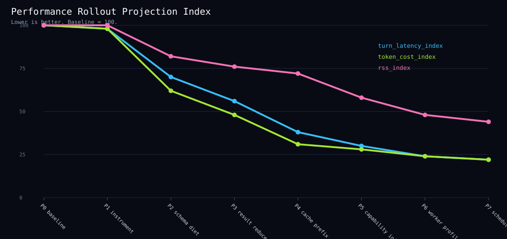
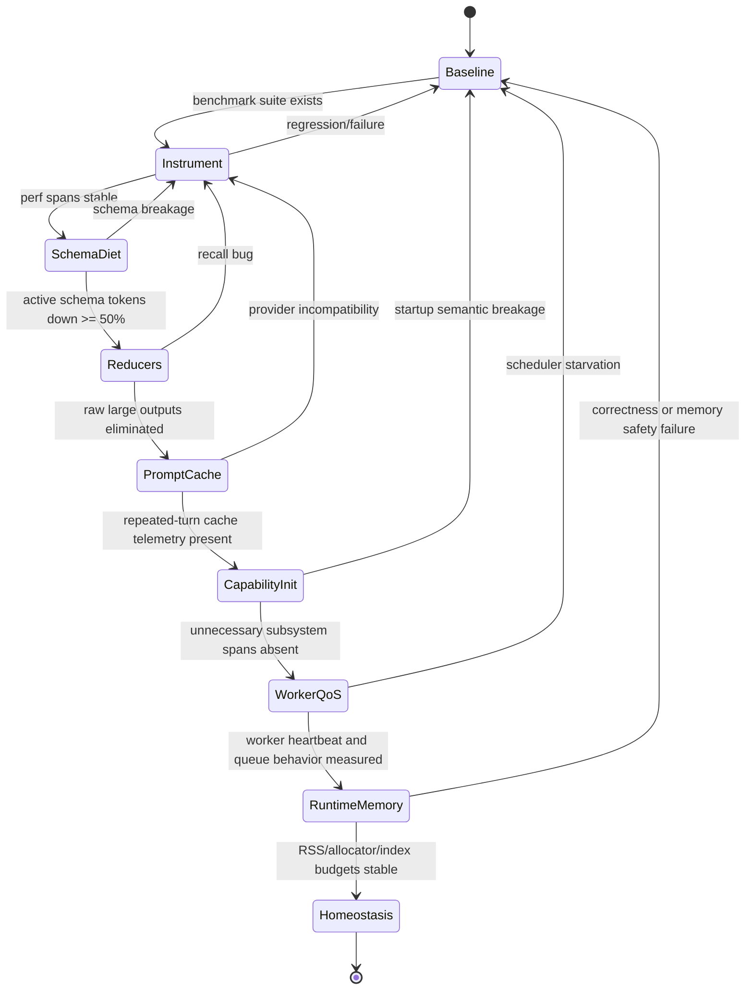
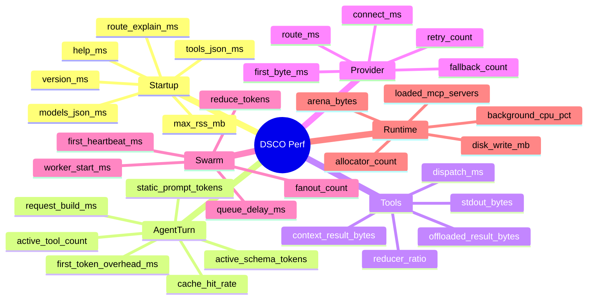
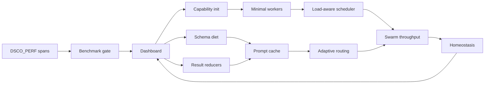

# DSCO Performance Push-Limit Report

Generated for dramatic systematic DSCO performance improvement.

Artifacts in this directory:

- `baseline_runs.jsonl` — raw repeated benchmark events.
- `baseline_summary.json` — summarized p50/p95/max latency.
- `baseline_latency.svg` — measured critical-path latency graph.
- `rollout_projection.svg` — projected performance index across rollout phases.
- `multiturn_rollout.jsonl` — executable multi-turn rollout control plane.
- `baseline.md` — compact generated baseline report.
- `startup_spans.csv` — extracted `DSCO_PERF=json` startup marks.
- `startup_spans.svg` — startup span timeline graph.

## 1. Baseline result



The current information/local fast paths are already strong. The largest remaining wins are not likely in `--version`/`--help` style startup. They are in agentic turn overhead: active schema bytes, context growth, tool-result bloat, provider routing, worker launch, swarm reduction, and background workload interference.

| Case | Interpretation |
|---|---|
| `version` | Already fast; protect with regression gate. |
| `help` | Already fast; check output stream semantics. |
| `tools_json` | Very fast despite large output; keep generated/static path. |
| `models_json` | Very fast; protect. |
| `tool_cwd` | Excellent local tool fast path. |
| `route_explain_sonnet` | Good route inspection path. |

## 2. Startup span extraction



`DSCO_PERF=json` is already live on these fast paths. A notable finding: even immediate exits report `profile:"full"` and full capability string in the perf context. The command still exits quickly, but the next hardening pass should make capability planning semantically precise for full-profile invocations too, so the perf trace proves what did and did not initialize.

## 3. Performance architecture target



## 4. Rollout projection



The projection is intentionally conservative: baseline is index 100, then expected improvement comes from schema diet, result reducers, prompt caching, capability-bit initialization, worker profiles, and scheduler control.

## 5. Multi-turn rollout state machine



## 6. Critical metrics dashboard



## 7. Initiative graph



## 8. Fully instrumented phase plan

The file `multiturn_rollout.jsonl` encodes each phase as executable turns. Every turn requires:

1. `perf_json_spans` — before/after spans.
2. `before_after_benchmark` — run the harness or a narrowed variant.
3. `artifact_manifest` — list changed files and generated measurements.
4. `rollback_note` — how to revert safely.

### Phase P1 — Measurement substrate

Goal: all future optimization becomes factual.

Required work:

- Wire stable spans into startup, registry, provider, tool dispatch, worker launch.
- Add p50/p95/RSS/schema-byte regression gates.
- Generate Markdown/SVG reports automatically.

Gate: every critical path emits stable JSON spans and benchmark scripts fail on regression.

### Phase P2 — Schema diet and tool packs

Goal: reduce model-visible schema load.

Required work:

- Task-class to tool-pack resolver.
- Compact active schemas separate from full discovery schema.
- Per-turn `active_schema_tokens`, `active_tool_count` metrics.

Gate: default model turn exposes <=40 active tools and active schema tokens drop >=50%.

### Phase P3 — Tool result reducers

Goal: stop raw output from exploding context.

Required work:

- Result handle protocol above byte threshold.
- Reducers for search, shell/build, diff/status, web fetch, and market scans.
- Metrics: `context_result_bytes`, `offloaded_result_bytes`, `reducer_ratio`.

Gate: large outputs no longer enter model context raw unless explicitly recalled.

### Phase P4 — Prompt cache architecture

Goal: make repeated turns cheaper and faster.

Required work:

- Split static prefix / semi-static project summary / dynamic tail.
- Provider-specific cache-control validation.
- Stable prompt cache key based on repo, model, tool-pack, identity version.

Gate: supported providers report cache reuse and repeated turn latency/cost decreases.

### Phase P5 — Capability-bit startup

Goal: initialize only what the command path needs.

Required work:

- Parse argv into command grammar and capability mask before subsystem init.
- Gate memory, MCP, TUI, market, browser, provider, and swarm init behind caps.
- Emit startup capability plan in route explain and perf spans.

Gate: info/local-tool paths prove no unnecessary subsystem spans occurred.

### Phase P6 — Worker profiles and swarm QoS

Goal: make swarms fast without melting the host.

Required work:

- Profiles: `local_tool`, `model_only`, `research`, `mcp`, `market`, `compile`.
- Load-aware launch scheduler.
- Structured bounded worker returns.

Gate: worker heartbeat latency improves and high load queues work rather than thrashing.

### Phase P7 — Runtime memory efficiency

Goal: reduce allocator/RSS jitter.

Required work:

- Per-turn arenas in parser, provider request build, tool arg parse, and result assembly.
- String interning for repeated provider/model/tool names.
- Generated indexes for skills/doctrine/tools/models.

Gate: allocator count/RSS/binary-size budgets improve or stay bounded.

## 9. Exact command surface

Run baseline:

```sh
./scripts/dsco_perf_rollout.py --runs 7 --out reports/perf_push_limit
```

Generate rollout control plane:

```sh
./scripts/dsco_perf_multiturn.py --out reports/perf_push_limit/multiturn_rollout.jsonl
```

Inspect summary:

```sh
cat reports/perf_push_limit/baseline_summary.json
open reports/perf_push_limit/baseline_latency.svg
open reports/perf_push_limit/rollout_projection.svg
```

## 10. Performance doctrine changes to enforce

1. No hot-path change merges without before/after benchmark.
2. Every model turn reports active tool count and active schema token estimate.
3. Every large tool output is reduced or offloaded.
4. Every worker has a profile, lease, heartbeat, and bounded return schema.
5. Every startup path has a capability plan visible in `DSCO_PERF=json`.
6. Every provider route has cached explainability.
7. Background learning obeys interactive QoS.

## 11. First implementation patch candidates

| Candidate | Why first |
|---|---|
| Expand perf spans | Measurement unlocks all else. |
| Add schema/token counters | Direct model-turn overhead metric. |
| Add result handle threshold | Prevent context blowups. |
| Capability plan for full profile | Current full profile can force maximal capabilities; specialize safely. |
| Worker profile enum | Swarm latency and load control. |

## 12. Pre-mortem

Likely failure modes:

- Optimizing already-fast info paths while ignoring agent-turn token cost.
- Adding instrumentation that itself bloats hot paths.
- Breaking provider-specific cache semantics.
- Tool result handles hiding necessary evidence from the model.
- Scheduler over-throttling remote calls because local load is high.
- Compact schemas losing enough semantic detail to harm tool-call accuracy.
- Capability gating skipping required governance for destructive operations.

Countermeasures:

- Keep instrumentation cheap and behind `DSCO_PERF` where possible.
- Preserve full schemas for discovery and use compact schemas only in active context.
- Make result recall explicit and paginated.
- Treat destructive/local privileged operations as immune-system gated regardless of perf path.
- Use before/after correctness smoke tests, not latency alone.

## 13. Definition of dramatic success

- Model-turn active schema tokens reduced by >=50%.
- Large tool-result context bytes reduced by >=80% on search/build/web-heavy tasks.
- Repeated supported-provider turns show prompt-cache reuse.
- Worker first heartbeat materially improves under normal load.
- High-load swarm behavior queues instead of amplifying system load.
- Info/local paths stay near current baseline and do not regress.
- Every claim above is backed by generated JSONL measurements and graph artifacts.
